# Databricks Core Concepts

Nine topics that make up the working surface of the Databricks platform, ordered so each is answerable from the ones before it. Sections 1–4 establish why the platform exists and what its vocabulary means; sections 5–13 take each mechanism in depth; section 14 pulls the threads together into a revision pass.

## 1. The data swamp

A data lake is a folder of files on cheap object storage. That is its entire appeal — store anything, in any format, for almost nothing — and also the source of every problem this platform exists to fix.

- **Two writers, no coordination, corrupt reads.** One job appends today's orders while a cleanup job rewrites the same directory to remove duplicates. Neither knows about the other. A query landing mid-write sees some new files and some old ones — a state that never existed as a consistent whole. Nothing in the storage layer prevents this, because object storage offers atomicity per object and nothing above it. The read succeeds, returns wrong numbers, and reports no error.
- **A crashed write leaves debris that breaks every subsequent query.** A Spark job killed halfway through leaves partial Parquet files in the output directory. Every query touching that directory now fails on a malformed footer, or worse, silently reads a truncated row group. Recovery means someone manually identifying and deleting the partial files — an operation with no record of what "partial" meant, done under pressure.
- **No schema enforcement means the schema drifts silently.** An upstream system adds a field, changes a type from integer to string, or drops a column. The lake accepts all of it, because a lake is a folder and folders do not validate. The breakage surfaces weeks later in a downstream aggregate that has been quietly wrong since the change.
- **No history means no recovery and no audit.** A bad transformation overwrites a table with garbage. There is no previous version to return to, because overwriting a file destroys what it held. Reconstructing yesterday's state requires a backup system entirely separate from the lake, and answering "what did this table look like when that report ran" is usually impossible.
- **The warehouse solves these, and introduces different costs.** A relational warehouse has ACID transactions, enforced schemas, and consistent reads — the exact four properties missing above. It pays for them with proprietary storage you cannot read with other tools, compute coupled to storage so scaling one means paying for both, and poor handling of the unstructured data (images, free-form JSON, audio) that motivated the lake in the first place. Running both systems means paying twice and maintaining fragile ETL to keep them synchronized.

The gotcha: these four failures are not exotic edge cases that careful engineering avoids. They are the default behavior of a filesystem being used as a database, and they scale with concurrency — a lake that behaves fine with one nightly writer starts producing wrong answers the week a second pipeline is added. The failure mode that matters is not the crash; it is the silent wrong answer, which is why the fix has to live in the storage layer rather than in each job's error handling.

## 2. Lakehouse, Delta Lake, and the vocabulary

Four terms get used interchangeably in casual conversation and mean genuinely different things. Precision here pays off in every later section.

- **Lakehouse — the architecture.** A single system providing warehouse guarantees (ACID transactions, schema enforcement, fast SQL) directly on top of cheap open-format object storage, so one copy of data serves BI, engineering, and machine learning without duplication into a separate warehouse. It is a design pattern, not a product.
- **Delta Lake — the storage layer that implements it.** An open-source format pairing ordinary Parquet data files with an ordered transaction log. The log is what supplies the guarantees section 1 found missing. Delta Lake is *what* makes a lakehouse possible; the lakehouse is *how* you organize data given that capability. Every table in Databricks is Delta by default.
- **Unity Catalog — the governance layer above both.** A single hierarchy of catalogs, schemas, and tables shared by every workspace in a region, holding permissions, lineage, and audit. It governs Delta tables but is not itself a storage format.
- **Medallion — the organizing convention on top.** Staging data through layers of increasing quality (bronze, silver, gold), each a set of Delta tables. It is a naming convention for a data-quality contract, not a feature you enable.
- **Apache Spark — the execution engine underneath everything.** The distributed processing engine that actually reads, transforms, and writes. Every notebook, SQL query, job, and pipeline compiles down to Spark work. Databricks is the commercial platform around it; Photon is a faster native reimplementation of its execution layer.

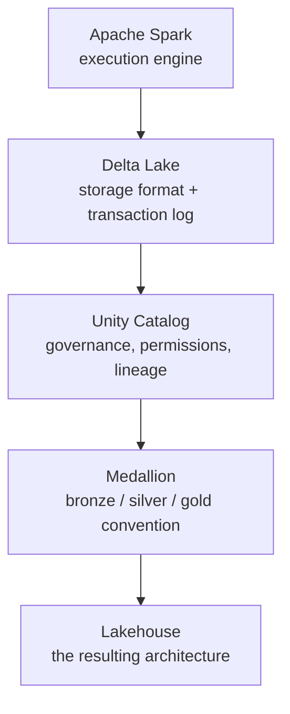

The gotcha: "lakehouse" and "Delta Lake" appear as distractors for each other constantly, and the distinction is architecture versus implementation. A question about *transaction guarantees* is about Delta Lake. A question about *serving BI and ML from one copy of data* is about the lakehouse. Conflating them makes questions about which layer solves a given problem unanswerable, because the answer is always "the layer that owns that concern" and you need the layers separated to say which one that is.

## 3. From Databricks Delta to Lakeflow

The platform's shape today is the accumulated result of seven years of specific releases, each fixing what the previous stage left open. Reading the sequence explains why several features overlap in scope and why some carry two names.

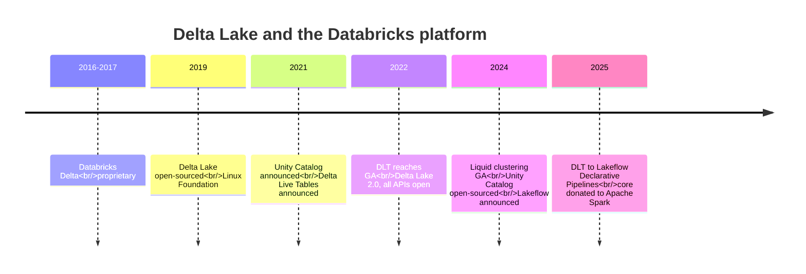

- **2016–2017 — Databricks (Databricks Delta).** Developed internally from 2016 and announced at Spark Summit 2017 as a proprietary Databricks feature. The transaction-log design that defines the format today was already in place; what was missing was any guarantee that data written this way remained readable outside Databricks — the precise concern that blocked adoption by organizations unwilling to accept format lock-in.
- **2019 (April) — Databricks and the Linux Foundation (Delta Lake open-sourced).** Announced April 24, 2019 and contributed to the Linux Foundation, making the format an open standard readable by any compliant engine. This is the release that made "open format" a defensible claim rather than marketing, and it is why a Delta table is readable by tools that have no relationship with Databricks.
- **2021 (May) — Databricks (Unity Catalog and Delta Live Tables announced).** Both announced at Data + AI Summit on May 26, 2021, addressing the two gaps the storage layer alone left open. Unity Catalog targeted governance: before it, each workspace kept its own Hive metastore, so the same table name meant different things in different workspaces with independently managed permissions. DLT targeted pipeline authoring: before it, every multi-hop pipeline was hand-wired notebooks plus manually declared task dependencies.
- **2022 (April) — Databricks (DLT reaches general availability).** GA on AWS and Azure April 5, 2022, public on Google Cloud. The declarative model — describe the target tables, let the runtime infer execution order from their references — moved from preview into production use.
- **2022 (June) — Databricks (Delta Lake 2.0, all APIs open-sourced).** Announced at Data + AI Summit that all Delta Lake features and enhancements would be contributed to the Linux Foundation, closing the gap where performance-critical capabilities remained Databricks-only while the base format was open.
- **2024 (May) — Databricks (liquid clustering GA).** Generally available May 22, 2024, on Databricks Runtime 15.4 LTS and above. It replaces the partitioning-versus-Z-ordering tradeoff with a single mechanism whose clustering keys can be redefined without rewriting the table — the first genuinely new answer to data layout since Z-ordering.
- **2024 (June) — Databricks (Unity Catalog open-sourced; Lakeflow announced).** Unity Catalog was open-sourced, extending the 2019 format-openness argument to the governance layer. Lakeflow was announced as the umbrella for ingestion (Connect), transformation (Declarative Pipelines), and orchestration (Jobs).
- **2025 — Databricks and Apache Spark (DLT becomes Lakeflow Declarative Pipelines).** At Data + AI Summit 2025, DLT was rebranded under the Lakeflow umbrella and its core donated to Apache Spark as Spark Declarative Pipelines. Existing DLT code continues to work with no migration required — the change is naming and governance of the project, not the programming model.

The gotcha: the 2025 renaming means current documentation, older tutorials, and the exam material you study may use three names — DLT, Lakeflow Declarative Pipelines, Spark Declarative Pipelines — for the same thing, and "Workflows" and "Lakeflow Jobs" likewise for another. Treat them as synonyms rather than assuming a renamed product is a different product with different semantics. The `@dlt.table` decorator and `dlt` Python module retain the original name in code even under the new branding, so the API surface gives no signal about which era of documentation you are reading.

## 4. The nine mechanisms

The rest of this document takes each mechanism in the order its dependencies allow. Governance defines where tables live before table types matter; table types precede the transaction log that backs them; the log precedes the SQL that queries it; and the production concerns (layout, ingestion, pipelines, optimization, scheduling) all assume everything before them.

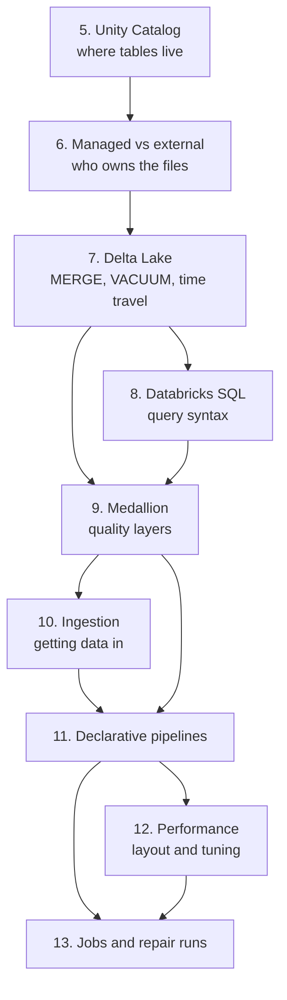

- **Governance first, because it defines the namespace everything else uses.** Section 5 covers the catalog hierarchy, privilege inheritance, and the view-based pattern for row and column security. Every table reference in every later section is a three-part name that only makes sense once this is established.
- **Table ownership next, because it is a one-time decision with permanent consequences.** Section 6 covers managed versus external tables — a distinction that determines whether dropping a table destroys its data, and which cannot be changed casually after the fact.
- **The transaction log, because it supplies every guarantee above it.** Section 7 covers `MERGE`, `VACUUM`, time travel, and table properties. These are the operations that make a folder of Parquet behave like a database, and their failure modes are the most consequential in the platform.
- **Query syntax, because it is how everything is read.** Section 8 covers the SQL surface — table creation variants, the six join types, window functions, semi-structured access, and higher-order array functions.
- **Medallion, because it is the convention every production pipeline follows.** Section 9 covers the layer contracts, why bronze is deliberately permissive, and the quarantine pattern for records that fail validation.
- **Ingestion, because data has to arrive before layers matter.** Section 10 covers direct file reads, `COPY INTO`, and Auto Loader, along with the streaming trigger modes that determine batch-versus-continuous behavior.
- **Declarative pipelines, because they replace hand-wired multi-hop code.** Section 11 covers the declarative model, expectations as graduated data-quality enforcement, and the streaming-table-versus-materialized-view choice.
- **Performance, because correct pipelines still need to be fast.** Section 12 covers file compaction, data skipping, partitioning, Z-ordering, liquid clustering, and join strategy — in diagnosis order rather than feature order.
- **Jobs, because production means running unattended and recovering from failure.** Section 13 covers task DAGs, trigger types, retry semantics, and repair runs.

The gotcha: this ordering is dependency order, not importance order, and the two diverge sharply. Sections 7 and 12 (the transaction log and performance) carry the most operational weight in practice but sit in the middle because they need the earlier vocabulary. Reading only the sections that sound relevant to an immediate problem tends to fail specifically here — a performance problem is frequently a table-layout problem, which is a section 6 decision made months earlier, and diagnosing it requires the material that appears to be about something else.

## 5. Unity Catalog and table management

Before Unity Catalog, each workspace kept its own Hive metastore. The same table name in `dev` and `prod` pointed at unrelated data, permissions were granted per workspace with no shared identity for a table, and answering "who can read customer PII" meant checking every workspace by hand. Unity Catalog puts one governance layer above every workspace in a region.

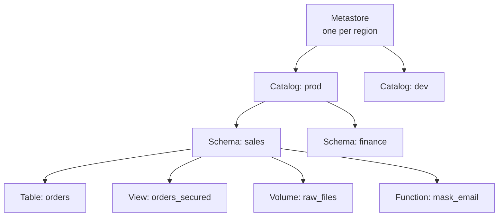

- **The three-level namespace, and why it exists.** Every securable object is addressed `catalog.schema.table`. The third level is what lets a `sales.orders` schema exist independently in both `dev` and `prod` catalogs without collision — the same short name resolving to genuinely different data depending on which catalog is in context. Schema and database are interchangeable terms in Databricks SQL; the same object accepts either keyword.
- **Privileges inherit downward, and traversal is a separate grant.** A privilege granted at catalog level applies to every schema and table beneath it, so granting `SELECT` on a catalog does not require re-granting it per table. Two prerequisites are easy to miss: `USE CATALOG` and `USE SCHEMA` grant the ability to traverse into a container, and without them an object-level `SELECT` grant has no effect. A user with `SELECT` on a table but no `USE SCHEMA` on its schema cannot query it.
- **Four kinds of securable live under a schema.** Tables and views hold queryable rows. Volumes hold governed non-tabular files — images, PDFs, model artifacts, anything that is not rows — with the same grant model as tables. Functions are registered SQL or Python UDFs, governed identically. The uniform treatment is the point: one permission model covers structured data, unstructured files, and code.

```sql
-- Build the hierarchy
CREATE CATALOG IF NOT EXISTS prod;
CREATE SCHEMA  IF NOT EXISTS prod.sales;

-- Set context so unqualified names resolve within it
USE CATALOG prod;
USE SCHEMA sales;
SELECT * FROM orders;                 -- resolves to prod.sales.orders

-- Traversal plus read, granted at schema level
GRANT USE CATALOG ON CATALOG prod        TO `analysts`;
GRANT USE SCHEMA  ON SCHEMA  prod.sales  TO `analysts`;
GRANT SELECT      ON SCHEMA  prod.sales  TO `analysts`;

-- Narrower grant on one object
GRANT SELECT, MODIFY ON TABLE prod.sales.orders TO `data-engineers`;

-- Introspection and removal
SHOW GRANTS ON TABLE prod.sales.orders;
REVOKE MODIFY ON TABLE prod.sales.orders FROM `data-engineers`;
```

- **Three principal types, with one clear default.** Users are individual humans, typically synced from a cloud identity provider. Groups are named collections, and granting to groups rather than individuals is the pattern that scales — adding someone to `analysts` confers everything that group holds, immediately and without a grant statement. Service principals are non-human identities for jobs and CI/CD, so automated access does not depend on any individual's account and does not break when that person leaves.
- **Row and column security is a view pattern, not a table primitive.** Unity Catalog has no row-filtering property you attach to a base table. The mechanism is a view whose own query filters or masks based on who is executing it, using `CURRENT_USER()` or `is_account_group_member()`, with grants issued on the view and none on the underlying table.

```sql
-- Row-level: each manager sees only their region
CREATE VIEW prod.sales.orders_secured AS
SELECT * FROM prod.sales.orders
WHERE region = (
  SELECT region FROM prod.sales.region_managers
  WHERE manager_email = CURRENT_USER()
);

-- Column-level: mask unless the caller is in a privileged group
CREATE VIEW prod.sales.customers_secured AS
SELECT
  customer_id,
  name,
  CASE WHEN is_account_group_member('pii-viewers') THEN ssn
       ELSE 'REDACTED' END AS ssn
FROM prod.sales.customers;

GRANT SELECT ON VIEW prod.sales.orders_secured TO `analysts`;
```

- **Lineage is captured automatically from real execution.** Unity Catalog observes queries as they run and builds a table- and column-level dependency graph from what they actually read and wrote — no manual tagging, no separate metadata pipeline. Three uses justify it: impact analysis before changing or dropping a column, tracing a wrong value in a gold table back through transformations to its source, and answering compliance questions about where regulated columns propagate.

The gotcha: a dynamic view enforces nothing if the user also holds a direct grant on the base table, because the security logic lives in the view's SQL rather than as a property of the underlying data. A user with `SELECT` on `prod.sales.orders` simply queries it and bypasses `orders_secured` entirely. Row-level security "not working" almost always traces to exactly this — a lingering direct grant, frequently inherited from a catalog- or schema-level grant issued before the view existed, which the inheritance rule above then propagates to every table underneath. Auditing view-based security means checking inherited grants at every level above the table, not just grants issued on the table itself.

## 6. Managed and external tables

One question separates the two table types, and it has permanent consequences: when you `DROP TABLE`, do the data files die with it?

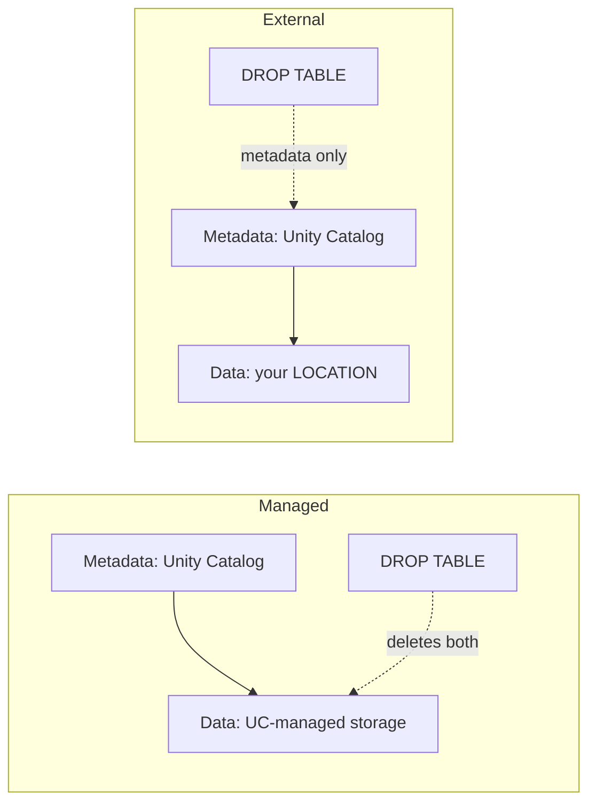

| | Managed | External |
|---|---|---|
| Data files owned by | Unity Catalog | You |
| `LOCATION` clause | Omitted | Required |
| `DROP TABLE` deletes | Data and metadata | Metadata only |
| Storage layout | UC-controlled | Whatever you point at |
| Best fit | Databricks is system of record | Files shared with other tools, or pre-existing |

```sql
-- Managed: no LOCATION, Unity Catalog chooses storage
CREATE TABLE prod.sales.orders (
  order_id    BIGINT,
  customer_id BIGINT,
  amount      DECIMAL(10,2)
);

-- External: explicit LOCATION, data lives where you say
CREATE TABLE prod.sales.orders_ext (
  order_id    BIGINT,
  customer_id BIGINT,
  amount      DECIMAL(10,2)
)
LOCATION 'abfss://container@account.dfs.core.windows.net/orders/';

-- Which is which? Read Type and Location from the output
DESCRIBE EXTENDED prod.sales.orders_ext;
DESCRIBE DETAIL   prod.sales.orders_ext;
```

- **External does not mean ungoverned.** Permissions, lineage, and audit apply identically to both table types — Unity Catalog governs access to an external table exactly as it does a managed one. "External" refers only to file lifecycle ownership, which is a narrower claim than it sounds and a common source of misplaced concern about governance gaps that do not exist.
- **Choose managed unless something specific forces otherwise.** Managed tables let Unity Catalog handle storage layout, cleanup, and optimization without coordination. The cases that genuinely require external are: files that other tools write or read directly, data that existed before the table was defined, regulatory requirements pinning data to a specific storage account, and cost arrangements tied to a particular container.
- **External locations and storage credentials gate which paths are usable.** A storage credential wraps the underlying cloud IAM identity. An external location binds that credential to a path prefix and is itself a securable object with its own grants. This two-level split means the cloud identity is defined once by an administrator, while access to specific paths is delegated separately.

```sql
CREATE STORAGE CREDENTIAL prod_cred
WITH AZURE_MANAGED_IDENTITY (ACCESS_CONNECTOR_ID = '...');

CREATE EXTERNAL LOCATION sales_raw
URL 'abfss://container@account.dfs.core.windows.net/raw/'
WITH (STORAGE CREDENTIAL prod_cred);

GRANT READ FILES  ON EXTERNAL LOCATION sales_raw TO `data-engineers`;
GRANT WRITE FILES ON EXTERNAL LOCATION sales_raw TO `etl-service-principal`;

SHOW EXTERNAL LOCATIONS;
```

- **Managed tables gain optimizations external tables do not.** Because Unity Catalog controls the storage layout of a managed table, it can apply automatic compaction, predictive optimization, and cleanup without risking interference with an external writer. An external table's files might be written by another system at any moment, so those automatic behaviors are unavailable or unsafe.

The gotcha: dropping an external table leaves its files in place, still accruing storage cost and still readable by anything holding path access — the table disappears from the catalog while the data quietly persists indefinitely. This is the intended behavior and it is also the most common source of both surprise cloud bills and data that was believed deleted for compliance purposes but was not. The inverse error is more destructive and less recoverable: `DROP TABLE` on a managed table deletes the underlying files, and while Delta's retention window offers a brief recovery opportunity via `UNDROP TABLE`, that window expires. Confirm the table type with `DESCRIBE EXTENDED` before dropping anything you cannot rebuild.

## 7. Delta Lake: MERGE, VACUUM, time travel, table properties

Section 1's four failures — corrupt concurrent reads, crash debris, silent schema drift, no history — all trace to the same root cause: a folder has no notion of a transaction. Delta Lake adds one, by keeping an ordered log beside the data that defines which files are actually part of the table.

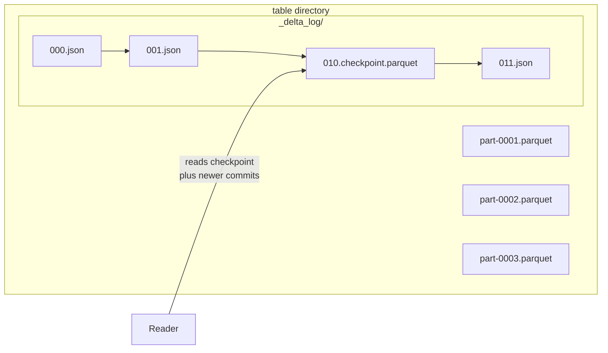

- **The log is the table; the Parquet files alone are not.** Every write commits a numbered JSON file listing `add` actions (new files, with per-column min/max statistics) and `remove` actions (files tombstoned, not yet deleted). A file sitting in the directory that no commit references is invisible to every reader. This indirection is what makes atomicity possible — the data files are written first and become part of the table only when a single log commit succeeds, so a crash before that commit leaves debris that is ignored rather than debris that corrupts.
- **Checkpoints keep log reads from degrading over time.** Replaying thousands of JSON commits on every query would make metadata resolution the bottleneck. Every 10 commits, Delta writes a Parquet checkpoint holding the full cumulative file list as of that version, so a reader jumps to the most recent checkpoint and replays only the handful of commits after it.
- **Snapshot isolation falls out of this design for free.** A query resolves the live file set once when it starts and reads only those files for its duration. Another write committing mid-query adds new log entries the running query never consults, so it sees a consistent snapshot rather than a shifting one — without any locking.

### MERGE INTO

```sql
MERGE INTO customers AS t
USING customer_updates AS s
ON t.customer_id = s.customer_id
WHEN MATCHED AND s.is_deleted = true THEN
  DELETE
WHEN MATCHED THEN
  UPDATE SET t.email      = s.email,
             t.address    = s.address,
             t.updated_at = current_timestamp()
WHEN NOT MATCHED THEN
  INSERT (customer_id, email, address, updated_at)
  VALUES (s.customer_id, s.email, s.address, current_timestamp());
```

- **One atomic operation covering three verbs.** `MERGE` joins target to source, then applies inserts, updates, and deletes in a single transaction. Either all of it commits or none of it does — there is no window where half the batch is applied.
- **It is idempotent, which is what makes retry safe.** Re-running the same source batch updates matched rows to the values they already hold and inserts nothing new, because those keys now exist. A pipeline that fails after a partial `MERGE` can simply re-run, which is why this is the standard upsert mechanism rather than a delete-then-insert pair.
- **A non-unique match key fails at runtime rather than choosing arbitrarily.** If one target row matches multiple source rows, Delta cannot determine which update wins and raises an error instead of picking one. Deduplicate the source or tighten the `ON` condition; the error is the format refusing to produce a silently arbitrary result.

### Time travel

```sql
-- What has happened to this table
DESCRIBE HISTORY prod.sales.orders;      -- version, timestamp, operation, user

-- Read a prior state
SELECT * FROM prod.sales.orders VERSION   AS OF 42;
SELECT * FROM prod.sales.orders TIMESTAMP AS OF '2026-08-01T00:00:00Z';
SELECT * FROM prod.sales.orders@v42;                    -- shorthand

-- Diff two versions
SELECT * FROM prod.sales.orders VERSION AS OF 42
EXCEPT
SELECT * FROM prod.sales.orders VERSION AS OF 41;

-- Roll the table back
RESTORE TABLE prod.sales.orders TO VERSION AS OF 42;
```

- **History is a byproduct of not overwriting files.** Because a commit tombstones old files rather than deleting them, every prior version remains reconstructable as long as its files survive. Time travel is not a separate backup feature; it is the log's natural consequence.
- **`RESTORE` moves forward, not backward.** It commits a *new* version whose live file set matches the target version. History is preserved, the restore appears in `DESCRIBE HISTORY` as its own operation, and you can time-travel to the state before the restore. Rolling back a rollback is therefore possible.

### VACUUM

```sql
VACUUM prod.sales.orders;                   -- default 7-day (168h) retention
VACUUM prod.sales.orders DRY RUN;           -- list what would be deleted
VACUUM prod.sales.orders RETAIN 168 HOURS;  -- explicit, equals default
VACUUM prod.sales.orders RETAIN 24 HOURS;   -- requires disabling a safety check
```

- **The only command here that physically deletes.** `OPTIMIZE` and `ZORDER` rewrite and add files but never remove the old ones — they only become unreferenced. `VACUUM` is what reclaims that storage, permanently and with no undo.
- **The 168-hour default protects in-flight readers, not just history.** A long-running query, a streaming consumer lagging behind, or a concurrent time-travel read all hold references to files the current version no longer uses. The retention window is sized so those readers finish before their files disappear.

### Table properties

```sql
ALTER TABLE prod.sales.orders SET TBLPROPERTIES (
  'delta.deletedFileRetentionDuration' = 'interval 30 days',
  'delta.logRetentionDuration'         = 'interval 60 days',
  'delta.autoOptimize.optimizeWrite'   = 'true',
  'delta.autoOptimize.autoCompact'     = 'true',
  'delta.enableChangeDataFeed'         = 'true',
  'delta.columnMapping.mode'           = 'name'
);

SHOW TBLPROPERTIES prod.sales.orders;
ALTER TABLE prod.sales.orders UNSET TBLPROPERTIES ('delta.enableChangeDataFeed');
```

- **Two separate retention settings both gate time travel.** `deletedFileRetentionDuration` controls how long tombstoned data files survive and is what `VACUUM` honours. `logRetentionDuration` controls how long commit history is kept. Time travel to a given point requires *both* to cover that window — raising one alone silently fails to extend the reachable range.
- **Change Data Feed emits row-level changes for downstream consumption.** With `enableChangeDataFeed`, Delta records which rows were inserted, updated, or deleted per version, readable via `table_changes()`. This turns a table into an incremental source without building change detection by hand.
- **Column mapping decouples logical names from physical Parquet fields.** Setting `columnMapping.mode` to `name` allows renaming and dropping columns without rewriting data files, because the logical schema now maps onto physical fields by identifier rather than position.

### Schema enforcement and evolution

```python
# Absorb newly-appearing columns automatically
(df.write.format("delta").mode("append")
   .option("mergeSchema", "true")
   .saveAsTable("prod.sales.orders"))

# Replace the schema wholesale
(df.write.format("delta").mode("overwrite")
   .option("overwriteSchema", "true")
   .saveAsTable("prod.sales.orders"))
```

- **Enforcement is the default and rejects mismatched writes outright.** Extra columns, missing columns, or incompatible types fail the write rather than being coerced or dropped. This is the direct fix for section 1's silent schema drift.
- **Evolution is opt-in per write, deliberately.** `mergeSchema` adds newly-appearing columns; `overwriteSchema` replaces the schema entirely. Both are specified per operation rather than as a table-level toggle, because permanently-on evolution recreates the problem enforcement solves.

The gotcha: `VACUUM` with a retention below 168 hours requires setting `spark.databricks.delta.retentionDurationCheck.enabled = false`, and that safety check exists for a reason people discover the hard way. Files can be deleted out from under a query that is still running, a streaming consumer that has not caught up, or a scheduled report reading a slightly older snapshot — producing hard failures with no recovery path, because the deletion is physical and irreversible. There is no undo, no restore from the log, and the affected version becomes permanently unreadable. Treat sub-default retention as an operation requiring a maintenance window with all readers stopped, not a routine cleanup tuning.

## 8. Databricks SQL and query syntax

Databricks SQL is ANSI SQL plus a set of extensions for the things a lakehouse does that a warehouse historically did not — reading files directly, reaching into JSON without parsing it first, and operating on arrays without flattening them into rows.

### Creating tables and views

```sql
-- Explicit schema
CREATE TABLE t (id BIGINT, ts TIMESTAMP, payload STRING);

-- CTAS: schema inferred from the query, populated atomically
CREATE OR REPLACE TABLE daily_totals AS
SELECT order_date, SUM(amount) AS total
FROM orders GROUP BY order_date;

-- Clones
CREATE TABLE backup DEEP CLONE prod.sales.orders;     -- independent copy of data
CREATE TABLE sandbox SHALLOW CLONE prod.sales.orders; -- metadata only, shares files

-- View variants
CREATE VIEW v AS SELECT ...;                    -- logical, recomputed per query
CREATE MATERIALIZED VIEW mv AS SELECT ...;      -- stored result, refreshed
CREATE TEMPORARY VIEW tv AS SELECT ...;         -- session-scoped
```

- **CTAS infers types but carries nothing else across.** Column names and types come from the `SELECT` output. Constraints, comments, partitioning, and table properties do not transfer — a CTAS from a carefully-constrained source produces an unconstrained target. Cast explicitly in the `SELECT` list to pin types rather than trusting inference.
- **Deep and shallow clones differ in what happens to the source.** A deep clone copies data files, producing a fully independent table. A shallow clone copies only metadata and references the source's existing files, which makes it near-instant and near-free — and means running `VACUUM` on the source can delete files the shallow clone still depends on.

### Joins

| Type | Returns |
|---|---|
| `INNER` | Rows with a match on both sides |
| `LEFT` / `RIGHT` | All rows from one side, plus matches |
| `FULL` | All rows from both sides |
| `LEFT SEMI` | Left rows *with* a match — left columns only, no duplication |
| `LEFT ANTI` | Left rows *without* a match |
| `CROSS` | Cartesian product |

```sql
-- Semi and anti avoid the row multiplication a plain join causes on one-to-many
SELECT * FROM customers c LEFT SEMI JOIN orders o ON c.id = o.customer_id;
SELECT * FROM customers c LEFT ANTI JOIN orders o ON c.id = o.customer_id;
```

- **Semi-join solves a specific correctness trap.** "Customers who placed an order" written as an inner join returns one row per order, not per customer, silently inflating any downstream count. `LEFT SEMI` returns each qualifying left row exactly once regardless of how many right-side matches exist.

### Window functions

```sql
SELECT
  customer_id,
  order_date,
  amount,
  ROW_NUMBER() OVER (PARTITION BY customer_id ORDER BY order_date)      AS seq,
  RANK()       OVER (PARTITION BY customer_id ORDER BY amount DESC)     AS rnk,
  DENSE_RANK() OVER (PARTITION BY customer_id ORDER BY amount DESC)     AS dense_rnk,
  NTILE(4)     OVER (ORDER BY amount)                                   AS quartile,
  LAG(amount)  OVER (PARTITION BY customer_id ORDER BY order_date)      AS prev_amount,
  LEAD(amount) OVER (PARTITION BY customer_id ORDER BY order_date)      AS next_amount,
  SUM(amount)  OVER (PARTITION BY customer_id ORDER BY order_date
                     ROWS BETWEEN UNBOUNDED PRECEDING AND CURRENT ROW)  AS running_total,
  AVG(amount)  OVER (PARTITION BY customer_id ORDER BY order_date
                     ROWS BETWEEN 6 PRECEDING AND CURRENT ROW)          AS moving_avg_7
FROM orders;
```

- **Windows compute across related rows without collapsing them.** `GROUP BY` reduces many rows to one; a window function keeps every row and adds a column computed over its partition. This is what makes running totals, per-group rankings, and row-to-row comparisons expressible in one pass.
- **The three ranking functions differ only in tie handling.** On a two-way tie at position 2: `RANK` yields 1,2,2,4 — it leaves a gap. `DENSE_RANK` yields 1,2,2,3 — no gap. `ROW_NUMBER` yields 1,2,3,4 — always unique, with tie order arbitrary unless the `ORDER BY` fully disambiguates.
- **The frame clause controls which rows the aggregate sees.** `ROWS BETWEEN UNBOUNDED PRECEDING AND CURRENT ROW` gives a running total; a bounded frame gives a moving window. Omitting the frame while supplying `ORDER BY` defaults to a running frame, which is a frequent source of unintended cumulative results where a whole-partition total was wanted.

### Semi-structured data and arrays

```sql
-- Colon operator: reach into a JSON string column with no parse step
SELECT raw:customer.id::BIGINT   AS customer_id,
       raw:items[0].sku          AS first_sku,
       raw:metadata.tags[*]      AS all_tags
FROM events;

-- Typed parse into a struct
SELECT from_json(raw, 'STRUCT<id BIGINT, items ARRAY<STRING>>') AS parsed FROM events;

-- Flatten arrays to rows
SELECT explode(items)       AS item FROM orders;   -- drops rows with empty/null arrays
SELECT explode_outer(items) AS item FROM orders;   -- keeps them, emits NULL
SELECT posexplode(items) AS (pos, item) FROM orders;

-- Higher-order functions: operate on arrays in place, no explode/regroup round-trip
SELECT
  FILTER(amounts, x -> x > 0)                    AS positives,
  TRANSFORM(amounts, x -> x * 1.1)               AS with_tax,
  REDUCE(amounts, 0, (acc, x) -> acc + x)        AS total,
  EXISTS(amounts, x -> x > 1000)                 AS has_large,
  AGGREGATE(amounts, 0, (acc, x) -> acc + x)     AS total_alt
FROM orders;
```

- **The colon operator avoids a parse-and-reserialize round trip.** Reading `raw:customer.id` from a JSON string column extracts the field directly. `from_json` is the alternative when a typed struct is needed for repeated access or a schema contract, at the cost of declaring the schema.
- **Higher-order functions replace explode-then-regroup.** Transforming array elements by exploding to rows, applying the change, and re-aggregating is expensive and error-prone. `TRANSFORM` and `FILTER` do it in place, preserving row structure entirely.

### Aggregation and dates

```sql
-- Multi-level subtotals
SELECT region, product, SUM(amount)
FROM sales GROUP BY ROLLUP (region, product);   -- subtotals + grand total
-- CUBE: every combination. GROUPING SETS: an explicit list.

-- Distinguish a real NULL from a subtotal row
SELECT region, GROUPING(region) AS is_subtotal, SUM(amount)
FROM sales GROUP BY ROLLUP (region);

-- Dates
SELECT
  date_trunc('month', order_ts)     AS month,
  date_add(order_date, 7)           AS due_date,
  datediff(ship_date, order_date)   AS days_to_ship,
  add_months(order_date, -1)        AS prior_month,
  to_date(order_string, 'yyyy-MM-dd') AS parsed
FROM orders;
```

The gotcha: `GROUP BY ROLLUP` and `CUBE` produce subtotal rows where the rolled-up column is `NULL`, which is indistinguishable from a genuine `NULL` in the data by inspection alone. A `WHERE region IS NOT NULL` filter applied afterwards silently removes subtotals, and a report that sums the result then double-counts or under-counts depending on which rows survived. `GROUPING(col)` returns 1 for a subtotal row and 0 for a data row, and is the only reliable way to tell them apart — filter and label on that, never on the column's nullness.

## 9. Medallion architecture

Raw data is rarely query-ready. Transforming it in one step means every consumer depends on that single transformation being correct for all of their differing needs, and a bug in it corrupts everything downstream with no intermediate state to inspect. The medallion pattern stages data through layers of increasing quality, each its own set of Delta tables, independently queryable and independently debuggable.

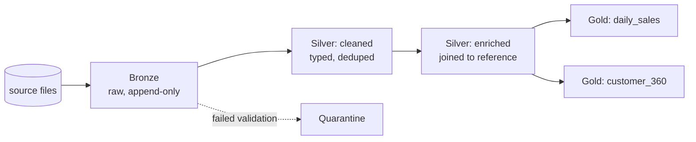

| Layer | Contract it upholds | Typical operations |
|---|---|---|
| Bronze | Faithful record of what the source actually sent | Append-only loads, loose types, ingestion metadata |
| Silver | Trustworthy — typed, deduplicated, validated | `MERGE`, filters, joins, constraints |
| Gold | Shaped for how it will be read | Aggregations, star schemas, denormalized marts |

- **Bronze is deliberately schema-permissive, and that is not sloppiness.** Storing fields as string, `VARIANT`, or binary means an upstream type change or new field does not break ingestion. Bronze's job is to capture what arrived, faithfully, so that a source-side change is a silver-layer problem to handle deliberately rather than a pipeline outage at 3am. Strict typing belongs one layer later.
- **Bronze ingestion must be idempotent or every layer inherits corruption.** Jobs fail and get re-run — a cluster dies mid-load, a timeout fires, someone triggers a backfill. If replay duplicates rows, that duplication propagates silently into every downstream aggregate. Auto Loader and `COPY INTO` both track which source files they have consumed precisely so replay is safe.
- **Silver enforces an explicit contract rather than an assumed one.** What silver guarantees to gold should be validated by the engine — constraints, expectations, or explicit checks — not left as an assumption baked into transformation code that breaks mysteriously when an upstream shape changes. The distinction is whether a violation fails loudly at the boundary or produces wrong numbers three layers down.
- **Gold is shaped by read patterns, not by computation convenience.** Gold tables are typically denormalized or star-modelled because their audience is a BI tool running repeated filtered aggregations. Reshaping data for read performance is the layer's purpose. Gold is also the most performance-sensitive layer to tune, being queried far more often than written.
- **Layers are contracts, not a table count.** Silver commonly splits into a cleaned stage and an enriched stage; gold fans out into many marts from one silver source. That is still three layers — sub-stages are implementation detail within a layer's contract, not new layers.

```python
from pyspark.sql.functions import col, current_timestamp

# Bronze: as-is, plus provenance columns
bronze = (spark.readStream.format("cloudFiles")
          .option("cloudFiles.format", "json")
          .option("cloudFiles.schemaLocation", "/chk/orders/schema")
          .load("/mnt/raw/orders/")
          .withColumn("_ingested_at", current_timestamp())
          .withColumn("_source_file", col("_metadata.file_path")))

(bronze.writeStream
   .option("checkpointLocation", "/chk/orders/bronze")
   .trigger(availableNow=True)
   .toTable("orders_bronze"))

# Silver: split valid from invalid so nothing vanishes silently
raw   = spark.table("orders_bronze")
is_ok = col("customer_id").isNotNull() & (col("order_total") > 0)

raw.filter(is_ok).write.mode("append").saveAsTable("orders_silver")
raw.filter(~is_ok).write.mode("append").saveAsTable("orders_quarantine")
```

```sql
-- Constraints as a backstop behind the filtering logic
ALTER TABLE orders_silver ALTER COLUMN customer_id SET NOT NULL;
ALTER TABLE orders_silver ADD CONSTRAINT positive_total CHECK (order_total > 0);
```

- **Quarantine preserves what filtering would discard.** Routing failed records to their own table keeps them available for debugging (what exactly was malformed), alerting (a spike in quarantined rows signals an upstream break worth paging someone about), and recovery (fix the cause, correct the rows, reprocess). Dropping them silently means the first symptom is a number that looks slightly low.

The gotcha: constraints and filtering solve different halves of the problem and neither substitutes for the other. A `CHECK` constraint rejects the write — it never routes anything anywhere, so declaring one does not create a quarantine table or populate it. Conversely, filtering logic alone has no backstop if the predicate has a bug. The working pattern is both: explicit filtering as the primary mechanism that routes records to the right destination, plus constraints on the silver table as a second line of defense that fails the write loudly if the filter ever lets something through it should not have.

## 10. Ingestion: files, COPY INTO, and Auto Loader

Data arrives as files in cloud storage. The question is how those files get picked up without reprocessing what was already loaded, and the answer depends almost entirely on volume and arrival pattern.

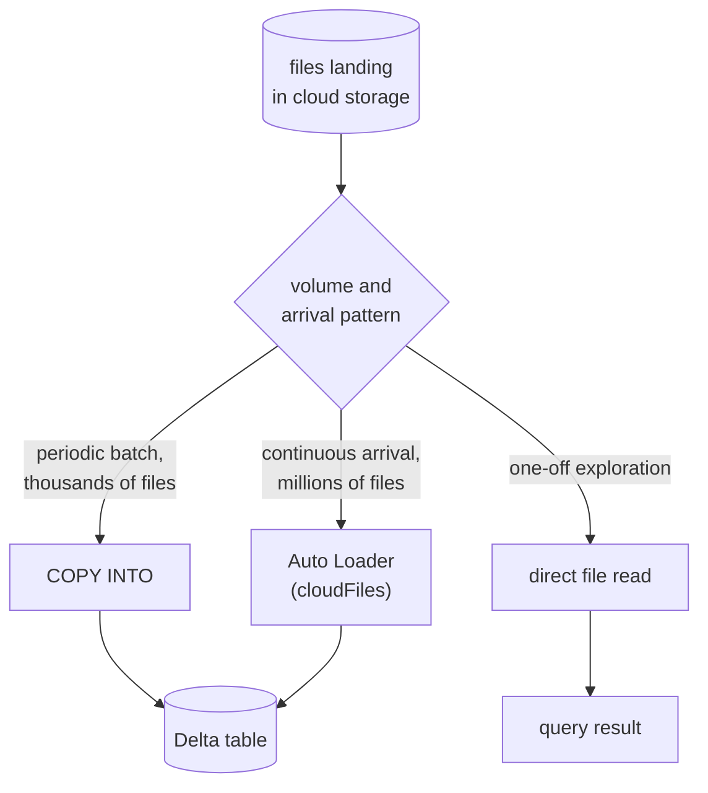

### Reading files directly

```sql
SELECT * FROM csv.`/mnt/raw/sales/`;
SELECT * FROM json.`/mnt/raw/events/`;
SELECT * FROM parquet.`/mnt/raw/archive/`;
```

```python
df = (spark.read.format("csv")
      .option("header", "true")
      .option("inferSchema", "true")      # costs a full extra pass
      .option("sep", ",")
      .option("mode", "PERMISSIVE")       # or DROPMALFORMED / FAILFAST
      .option("rescuedDataColumn", "_rescued")
      .load("/mnt/raw/sales/"))
```

- **`inferSchema` reads the data twice.** One pass to determine types, one to load. On anything large this doubles the cost, and it can infer differently between runs as data changes. Supply an explicit schema in production.
- **The three parse modes differ in what happens to malformed rows.** `PERMISSIVE` (the default) sets unparseable fields to `NULL` and keeps the row. `DROPMALFORMED` discards the row. `FAILFAST` aborts the read. `rescuedDataColumn` captures data that did not fit the schema rather than losing it, which makes `PERMISSIVE` recoverable rather than lossy.

### COPY INTO

```sql
COPY INTO sales_bronze
FROM '/mnt/raw/sales/'
FILEFORMAT = JSON
FORMAT_OPTIONS ('inferSchema' = 'true')
COPY_OPTIONS  ('mergeSchema' = 'true');

-- Narrow the input, or force reprocessing
COPY INTO sales_bronze FROM '/mnt/raw/sales/'
FILEFORMAT = CSV
PATTERN = '*.csv'
COPY_OPTIONS ('force' = 'true');
```

- **Idempotent by tracking what it loaded.** `COPY INTO` records which files it has consumed and skips them on re-run, so scheduling it repeatedly is safe and re-running after a failure does not duplicate. `force = 'true'` deliberately overrides this for intentional reprocessing.

### Auto Loader

```python
df = (spark.readStream.format("cloudFiles")
      .option("cloudFiles.format", "json")
      .option("cloudFiles.schemaLocation", "/chk/sales/schema")
      .option("cloudFiles.schemaEvolutionMode", "addNewColumns")
      .option("cloudFiles.useNotifications", "true")
      .option("cloudFiles.maxFilesPerTrigger", 1000)
      .load("/mnt/raw/sales/"))

(df.writeStream
   .option("checkpointLocation", "/chk/sales/write")
   .option("mergeSchema", "true")
   .trigger(availableNow=True)
   .toTable("sales_bronze"))
```

| | COPY INTO | Auto Loader |
|---|---|---|
| Model | SQL command, scheduled | Structured Streaming source |
| File discovery | Directory listing each run | Notifications or incremental listing, checkpointed |
| Practical scale | Thousands of files | Millions |
| Schema | Fixed or manually specified | Inference plus evolution built in |
| State | Tracked internally per table | External checkpoint directory |

- **Two independent state directories, easily confused.** `schemaLocation` holds the inferred schema and its evolution history. `checkpointLocation` holds stream progress — which files have been processed. They serve different purposes and deleting either has different consequences.
- **`availableNow=True` gives batch scheduling with streaming machinery.** Auto Loader is a streaming source but need not run continuously. This trigger processes everything currently pending and stops, so a scheduled Job can invoke it while retaining scalable file discovery and schema evolution.
- **Notification mode scales past directory listing.** With `useNotifications`, Auto Loader subscribes to cloud storage events rather than listing the directory, which is what makes millions of files tractable — listing cost grows with directory size, notification cost does not.

### Streaming triggers

```python
.trigger(processingTime="5 minutes")   # micro-batch on a fixed clock
.trigger(availableNow=True)            # drain everything pending, then stop
.trigger(continuous="1 second")        # low-latency, limited operation support
```

The gotcha: deleting a stream's `checkpointLocation` to "reset" a pipeline causes it to reprocess every file from the beginning, which against an append-only bronze table means duplicating the entire history. The checkpoint is the only record of what was already consumed — it is not a cache, and there is no reconciliation against the target table to detect the duplication. When a stream genuinely needs restarting from scratch, the target table has to be truncated or rebuilt in the same operation. The related trap is pointing two different streams at one checkpoint directory, which corrupts progress tracking for both in ways that surface as missing rather than duplicated data.

## 11. Declarative pipelines: DLT, Lakeflow, and Spark Declarative Pipelines

Every pipeline in sections 9 and 10 is imperative: read bronze, transform, write silver; then a second notebook reads silver and writes gold; then a Job wires them with an explicit dependency so the second runs after the first. Every mechanical detail is a decision someone made and maintains — which table to read first, when to trigger the next step, what to do when a step fails midway, how large a cluster to provision, where checkpoints live, how to recover from a partial write. None of that is business logic. All of it is failure surface.

The declarative alternative inverts the relationship. You describe what each table should contain — "silver is bronze filtered to valid rows", "gold is silver aggregated by day" — and the runtime derives the rest: execution order from which table references which, retries from its own failure handling, cluster sizing from the workload, and checkpoint management from the pipeline definition. The engineer states intent; the runtime owns mechanism.

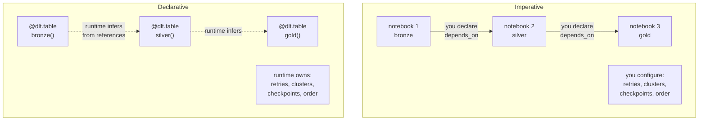

- **The name changed three times; the programming model did not.** Announced as Delta Live Tables in 2021, GA in 2022, rebranded under the Lakeflow umbrella in 2025, with the core donated to Apache Spark as Spark Declarative Pipelines. Existing code requires no migration — the `dlt` Python module and `@dlt.table` decorator keep their original names. When documentation, tutorials, and exam material disagree on the name, they are describing the same system.
- **Lakeflow is three components, and pipelines are only one.** Lakeflow Connect handles ingestion, Lakeflow Declarative Pipelines handles transformation, Lakeflow Jobs handles orchestration (section 13). "Lakeflow" alone is ambiguous; the component name matters.

### Defining tables

```python
import dlt
from pyspark.sql.functions import col, sum as _sum, current_timestamp

@dlt.table(
    name="orders_bronze",
    comment="Raw orders exactly as delivered",
    table_properties={"quality": "bronze", "delta.autoOptimize.optimizeWrite": "true"},
    partition_cols=["ingest_date"]
)
def orders_bronze():
    return (spark.readStream.format("cloudFiles")
            .option("cloudFiles.format", "json")
            .option("cloudFiles.schemaLocation", "/chk/orders/schema")
            .load("/mnt/raw/orders/")
            .withColumn("_ingested_at", current_timestamp()))

@dlt.table(comment="Validated and typed orders")
def orders_silver():
    return (dlt.read_stream("orders_bronze")
            .filter(col("customer_id").isNotNull())
            .withColumn("order_total", col("order_total").cast("decimal(10,2)")))

@dlt.table(comment="Daily revenue by region")
def daily_revenue():
    return (dlt.read("orders_silver")
            .groupBy("region", "order_date")
            .agg(_sum("order_total").alias("revenue")))
```

```sql
CREATE OR REFRESH STREAMING TABLE orders_bronze
COMMENT "Raw orders exactly as delivered"
TBLPROPERTIES ("quality" = "bronze")
AS SELECT *, current_timestamp() AS _ingested_at
FROM cloud_files("/mnt/raw/orders/", "json");

CREATE OR REFRESH STREAMING TABLE orders_silver
(CONSTRAINT valid_customer EXPECT (customer_id IS NOT NULL) ON VIOLATION DROP ROW)
COMMENT "Validated and typed orders"
AS SELECT * FROM STREAM(LIVE.orders_bronze);

CREATE OR REFRESH MATERIALIZED VIEW daily_revenue
AS SELECT region, order_date, SUM(order_total) AS revenue
FROM LIVE.orders_silver
GROUP BY region, order_date;
```

- **The dependency graph comes from references, not declarations.** `orders_silver` calling `dlt.read_stream("orders_bronze")` *is* the dependency statement. In SQL, `LIVE.orders_bronze` serves the same role. There is no `depends_on`, no ordering configuration, and no way for the declared order to drift out of sync with the actual data flow — because they are the same thing.
- **`dlt.read` and `dlt.read_stream` select the processing model.** `read_stream` treats the upstream as an incremental append-only source, processing only new rows. `read` treats it as a complete table, reading all of it. The choice determines whether the downstream table can be incremental, and mismatching it against the source's actual behavior is a common source of either wasted recomputation or missed updates.
- **`LIVE.` scopes references to the pipeline.** It resolves to the pipeline's own version of a table rather than whatever exists in the catalog under that name, which is what allows the same pipeline definition to run against dev and prod targets without editing table references.

### Expectations

Expectations are declarative data-quality rules attached to a table definition, with three enforcement levels. Section 9's quarantine pattern built this by hand — filter valid rows one way, invalid rows another. Expectations express the same intent as a rule the runtime enforces and reports on.

```python
@dlt.table
@dlt.expect("reasonable_total", "order_total < 1000000")
@dlt.expect_or_drop("valid_customer", "customer_id IS NOT NULL")
@dlt.expect_or_fail("known_currency", "currency IN ('USD','EUR','GBP')")
def orders_silver():
    return dlt.read_stream("orders_bronze")

# Multiple rules at once
@dlt.table
@dlt.expect_all({
    "valid_total": "order_total > 0",
    "valid_date":  "order_date IS NOT NULL"
})
@dlt.expect_all_or_drop({
    "valid_customer": "customer_id IS NOT NULL",
    "valid_region":   "region IN ('NA','EMEA','APAC')"
})
def orders_validated():
    return dlt.read_stream("orders_bronze")
```

| Decorator | Failing row | Pipeline | Use when |
|---|---|---|---|
| `@dlt.expect` | Kept in output | Continues | Monitoring a soft signal without altering data |
| `@dlt.expect_or_drop` | Excluded from output | Continues | The row is unusable but its absence is tolerable |
| `@dlt.expect_or_fail` | — | Update fails immediately | A violation means something upstream is fundamentally broken |

- **All three record metrics regardless of enforcement.** Every expectation's pass and fail counts land in the pipeline event log whether or not it alters the data, which makes `@dlt.expect` genuinely useful as pure instrumentation — a rising violation rate on a soft rule is an early warning before it becomes a hard failure.
- **Severity is chosen per rule, not per table.** One table commonly carries all three levels, as above: a sanity check that only warns, a validity check that drops the row, and a structural check that halts everything. The decision for each is what a violation actually implies — bad data point, unusable row, or broken upstream contract.
- **`expect_or_fail` fails the entire update, not just the batch.** It is the right choice when continuing would build correct-looking aggregates on fundamentally wrong data, and the wrong choice for anything routine — a single malformed record halting a production pipeline at 3am should be a deliberate decision, not a default.

### Streaming tables and materialized views

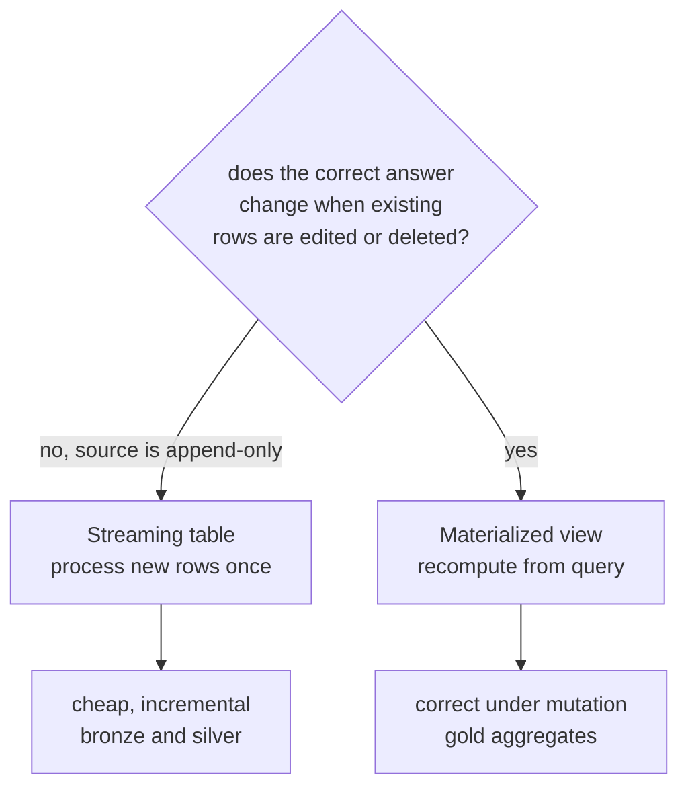

- **A streaming table processes each input row exactly once, incrementally.** New data is appended; already-processed rows are never revisited. This is correct and cheap for append-only sources — raw event ingestion, log capture, anything where history does not change. It is the natural fit for bronze and most silver tables.
- **A materialized view recomputes from its defining query.** Whenever it refreshes, it produces the current correct result of that query — which is what you need when an upstream edit or delete changes the right answer. A "total sales per region" aggregate over a table that accepts corrections cannot be maintained by appending; it has to be recomputed. This is the natural fit for gold.
- **The deciding question is mutability, not layer.** Layer is a useful heuristic but the actual test is whether the upstream data is append-only from this table's perspective. A silver table fed by a `MERGE`-updated source needs materialized-view semantics despite being silver.

### Change data capture with APPLY CHANGES

```python
dlt.create_streaming_table("customers_silver")

dlt.apply_changes(
    target="customers_silver",
    source="customers_cdc_bronze",
    keys=["customer_id"],
    sequence_by=col("change_ts"),
    apply_as_deletes=expr("operation = 'DELETE'"),
    except_column_list=["operation", "change_ts"],
    stored_as_scd_type=1
)
```

```sql
APPLY CHANGES INTO LIVE.customers_silver
FROM STREAM(LIVE.customers_cdc_bronze)
KEYS (customer_id)
APPLY AS DELETE WHEN operation = 'DELETE'
SEQUENCE BY change_ts
COLUMNS * EXCEPT (operation, change_ts)
STORED AS SCD TYPE 2;
```

- **`APPLY CHANGES` handles out-of-order events, which hand-written `MERGE` does not.** `SEQUENCE BY` tells the runtime which column orders the changes, so a late-arriving update carrying an older timestamp does not overwrite a newer value. Reproducing that correctly with `MERGE` requires window functions to deduplicate per key by sequence before merging — the operation this replaces.
- **SCD Type 1 overwrites; Type 2 preserves history.** `STORED AS SCD TYPE 1` keeps only current state. Type 2 inserts a new row per change with validity ranges, so point-in-time queries remain answerable. The declaration is one clause rather than the several dozen lines of `MERGE` logic Type 2 otherwise requires.

### Pipeline modes and operations

| Setting | Options | Effect |
|---|---|---|
| Execution | Triggered / Continuous | Process available data and stop, versus run indefinitely |
| Channel | Current / Preview | Runtime version stability versus early features |
| Development mode | On / Off | Reuse cluster and skip retries for fast iteration, versus production behavior |
| Full refresh | Per table or pipeline | Recompute from scratch, discarding existing state |

```sql
-- The event log is a queryable table
SELECT timestamp, event_type, details:flow_definition.output_dataset AS dataset
FROM event_log(TABLE(catalog.schema.my_pipeline))
WHERE event_type = 'flow_progress'
ORDER BY timestamp DESC;

-- Expectation results per run
SELECT
  details:flow_progress.data_quality.expectations
FROM event_log(TABLE(catalog.schema.my_pipeline))
WHERE event_type = 'flow_progress';
```

- **Development mode changes failure behavior, not just speed.** It reuses the cluster between runs and disables retries so errors surface immediately rather than being retried into a slower failure. Leaving it on in production means losing automatic retry — a setting difference that only manifests during an incident.
- **Full refresh discards state deliberately and destructively.** It recomputes a table from scratch, which for a streaming table means reprocessing all source data. It is the correct response to a logic change that invalidates prior output, and the wrong response to a transient failure — for which a normal update suffices.
- **The event log is the operational interface.** It is a queryable table holding every pipeline event: flow progress, expectation pass and fail counts, cluster provisioning, and failures with their causes. Debugging a declarative pipeline means querying it rather than reading scattered driver logs, since the runtime owns the execution the logs would otherwise describe.

The gotcha: `expect_or_drop` excludes failing rows from the output table and does not route them anywhere — there is no automatic quarantine destination, despite this being exactly what section 9's quarantine pattern existed to provide. Dropped rows appear only as a count in the event log; the row contents are gone. Building genuine quarantine under DLT requires an explicit second table fed by the negated predicate, the same as the imperative pattern. A second trap sits in the same area: because the runtime infers dependencies from references, a table nothing references is still computed if it is defined in the pipeline, while a table referenced but never defined fails at graph-resolution time rather than at runtime — meaning a typo in a `dlt.read()` name surfaces as a pipeline that will not start, with an error naming a dataset that does not exist rather than pointing at the line containing the typo.

## 12. Performance: layout, skipping, and query tuning

A slow query has a small number of root causes, and the useful discipline is diagnosing which one applies before changing anything. Applying Z-ordering to a query that is slow because of skew, or partitioning to a table that is slow because of small files, spends effort and changes nothing.

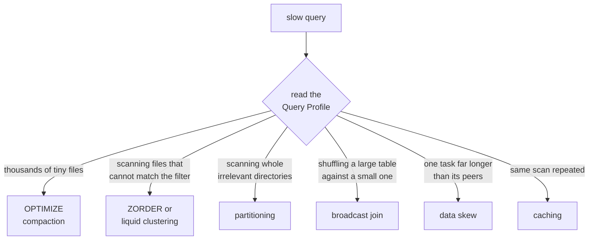

### File compaction and data skipping

```sql
OPTIMIZE prod.sales.orders;
OPTIMIZE prod.sales.orders WHERE order_date >= '2026-01-01';   -- bounded scope
OPTIMIZE prod.sales.orders ZORDER BY (customer_id, order_date);
```

- **Small files are a metadata and I/O problem simultaneously.** Streaming writes and frequent small appends leave hundreds or thousands of small Parquet files. Every query opens each one, reads its footer, and pays per-file overhead that dwarfs the actual data read. `OPTIMIZE` bin-packs them into fewer, larger files.
- **Data skipping is why per-file statistics exist.** Delta records min and max values per column per file in the transaction log. A query filtering `WHERE customer_id = 500` skips any file whose recorded range excludes 500 without opening it. Skipping effectiveness depends entirely on how tightly clustered those ranges are.
- **`ZORDER` tightens those ranges by co-locating related values.** It reorganizes rows across files so that values close in the Z-ordered columns land in the same file, narrowing each file's min/max range and making skipping actually eliminate files. It only helps on columns genuinely used in filters, and spreading it across many columns dilutes the clustering of every one — two or three columns is the practical limit.

### Partitioning

```sql
CREATE TABLE events (event_id BIGINT, event_date DATE, payload STRING)
PARTITIONED BY (event_date);

SHOW PARTITIONS events;
```

- **Partitioning is a physical directory split, and it is coarse.** Each distinct partition value becomes its own directory. A query filtering on the partition column skips entire directories without consulting statistics. This works well for low-cardinality columns queried by equality or range — a date column on a large table being the canonical fit.
- **High-cardinality partitioning creates the problem it was meant to solve.** Partitioning by `customer_id` or a timestamp produces thousands or millions of directories, each holding a handful of tiny files. Metadata operations slow to a crawl and the small-file problem returns amplified. The rule of thumb is not to partition tables under roughly 1 TB at all, and to partition only on columns with manageable cardinality above that.

### Liquid clustering

```sql
CREATE TABLE orders (...) CLUSTER BY (customer_id, order_date);
ALTER TABLE orders CLUSTER BY (region);       -- redefine, no rewrite
ALTER TABLE orders CLUSTER BY AUTO;           -- runtime chooses keys
OPTIMIZE orders;                              -- applies clustering incrementally
```

- **It replaces the partitioning-versus-Z-order decision entirely.** Generally available since May 2024 on Runtime 15.4 LTS and above, liquid clustering handles both roles with one mechanism, and handles skew and evolving access patterns that fixed partitioning cannot.
- **Clustering keys can change without rewriting the table.** `ALTER TABLE ... CLUSTER BY` redefines the keys, and subsequent `OPTIMIZE` runs apply the new clustering incrementally. Changing a partitioning scheme, by contrast, means rewriting the table entirely — which is why partitioning decisions made early tend to persist long after the query patterns that justified them have changed.

### Write-side and query-side tuning

```sql
ALTER TABLE orders SET TBLPROPERTIES (
  'delta.autoOptimize.optimizeWrite' = 'true',   -- right-size files during write
  'delta.autoOptimize.autoCompact'   = 'true'    -- compact small files after write
);
```

```python
from pyspark.sql.functions import broadcast

result = large_df.join(broadcast(small_df), "key")   # ship the small side, no shuffle

df.cache()        # lazy — populated by the next action
df.count()        # materializes the cache
df.unpersist()    # release it

df.repartition(200, "customer_id")   # full shuffle, up or down
df.coalesce(50)                      # decrease only, avoids full shuffle
```

- **Broadcast joins eliminate the shuffle when one side is small.** Shipping a small table to every executor lets each one join locally, avoiding the network-wide redistribution a shuffle join requires. Adaptive Query Execution applies this automatically when statistics show one side is small enough; the explicit hint is for cases where statistics are missing or wrong.
- **Skew is the most common mystery slowdown.** One partition far larger than the rest means one task runs long after every other has finished, and the stage cannot complete until it does. The signature in the Query Profile is a single task with a duration far above the median. AQE handles many cases automatically; the manual remedies are salting the key or repartitioning.
- **`repartition` and `coalesce` are not interchangeable.** `repartition` performs a full shuffle and can increase or decrease partition count, distributing evenly. `coalesce` only decreases and avoids a full shuffle by merging adjacent partitions, which is cheaper but can leave uneven partitions.
- **Photon accelerates without code changes.** It is a native vectorized C++ reimplementation of Spark's execution layer, enabled per cluster or via Pro and Serverless SQL warehouses. Scan, filter, aggregate, and join workloads benefit most; the API is unchanged.

The gotcha: `OPTIMIZE` rewrites data into new files and leaves the originals in place as unreferenced tombstones until `VACUUM` removes them, which means running it aggressively on a large table can double storage consumption for the duration of the retention window. On a table optimized daily with a 30-day retention, the accumulated tombstones can substantially exceed the live data. The related trap is running `OPTIMIZE` without a `WHERE` clause on a table where only recent partitions receive writes — it rewrites historical data that was already well-organized, burning compute and generating tombstones for no benefit. Bound the scope to the range that actually changed.

## 13. Jobs, scheduling, and repair runs

Production means running unattended, on a schedule, with recovery from failure that does not require someone to reconstruct what already succeeded.

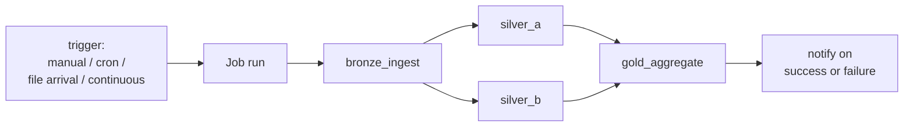

A Job is one or more Tasks wired into a DAG. A Task runs a notebook, Python script, SQL query, dbt project, or a pipeline. Workflows and Lakeflow Jobs are two names for the same product.

```json
{
  "name": "daily_sales_etl",
  "schedule": {
    "quartz_cron_expression": "0 0 2 * * ?",
    "timezone_id": "UTC",
    "pause_status": "UNPAUSED"
  },
  "max_concurrent_runs": 1,
  "tasks": [
    {
      "task_key": "bronze_ingest",
      "notebook_task": {
        "notebook_path": "/pipelines/bronze",
        "base_parameters": { "run_date": "{{job.start_time.iso_date}}" }
      },
      "job_cluster_key": "etl_cluster",
      "max_retries": 3,
      "min_retry_interval_millis": 60000,
      "retry_on_timeout": true,
      "timeout_seconds": 3600
    },
    {
      "task_key": "silver_clean",
      "depends_on": [{ "task_key": "bronze_ingest" }],
      "notebook_task": { "notebook_path": "/pipelines/silver" }
    },
    {
      "task_key": "gold_aggregate",
      "depends_on": [{ "task_key": "silver_clean" }],
      "notebook_task": { "notebook_path": "/pipelines/gold" }
    }
  ],
  "email_notifications": {
    "on_failure": ["data-team@example.com"],
    "on_duration_warning_threshold_exceeded": ["data-team@example.com"]
  }
}
```

- **Four trigger types, covering different arrival patterns.** Manual for on-demand runs. Scheduled with a cron expression for fixed cadence. File arrival for starting when new data lands at a storage location. Continuous for keeping a job perpetually running, starting the next run when the previous ends.
- **Retry and continuous are unrelated despite both meaning "run again".** A retry re-executes a failed task inside the same run, preserving the run's identity and history. Continuous starts an entirely new run after the previous completes. Confusing them produces either a job that never retries transient failures or one that runs far more often than intended.
- **Failure short-circuits rather than cascading.** A task becomes eligible only when its dependencies succeed, so downstream tasks are skipped rather than executed against incomplete data. This is the DAG structure doing its job — the alternative, running gold against a half-written silver table, produces wrong numbers instead of a clean failure.
- **Fan-out and fan-in are both supported.** Multiple tasks can depend on one upstream task, and one task can depend on several. The graph shape is a genuine DAG, not a chain, and independent branches run in parallel automatically.

### Repair runs

A repair re-executes only the tasks that failed and those skipped because of that failure, reusing the output of everything that already succeeded.

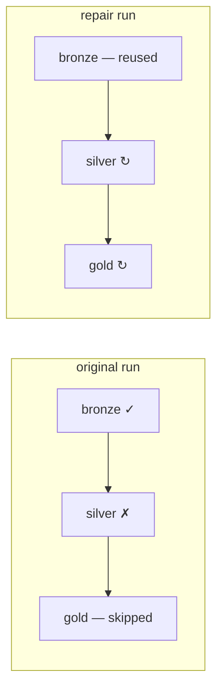

```bash
# Repair specific tasks
databricks jobs repair-run --run-id 12345 \
  --rerun-tasks silver_clean,gold_aggregate

# Repair everything that did not succeed
databricks jobs repair-run --run-id 12345 --rerun-all-failed-tasks

# Repair with changed parameters
databricks jobs repair-run --run-id 12345 \
  --rerun-all-failed-tasks \
  --notebook-params '{"run_date": "2026-08-20"}'
```

- **The repair attaches to the original run rather than creating a new one.** Run history shows the failure and the subsequent fix as one unit, which keeps the operational record coherent — a job that failed and was repaired reads as exactly that, not as one failed run plus one unexplained successful run.
- **Reusing successful output is the entire point.** Re-running a six-hour DAG because its last task failed wastes the five hours that worked. Repair skips them.
- **Parameters can change on repair.** A run that failed because of a bad parameter can be repaired with a corrected one rather than being abandoned and re-triggered from scratch.

### Parameters, values, and permissions

```python
# Task parameters arrive as widgets
dbutils.widgets.text("run_date", "")
run_date = dbutils.widgets.get("run_date")

# Pass values between tasks
dbutils.jobs.taskValues.set(key="row_count", value=42)
upstream_count = dbutils.jobs.taskValues.get(
    taskKey="bronze_ingest", key="row_count", debugValue=0
)
```

| Permission | Grants |
|---|---|
| `CAN_VIEW` | See configuration, run history, and logs |
| `CAN_MANAGE_RUN` | Trigger and cancel runs, plus everything above |
| `CAN_MANAGE` | Edit tasks, schedule, permissions, delete, plus everything above |

- **Job permissions and data permissions are orthogonal.** `CAN_MANAGE` on a job grants nothing on the tables that job reads or writes. The run-as identity — typically a service principal — needs its own Unity Catalog grants, and a job failing with `PERMISSION_DENIED` is usually about that identity rather than the person who triggered it.
- **Asset Bundles define jobs as versioned code.** A `databricks.yml` declares jobs and pipelines with per-environment targets, deployed via `databricks bundle deploy -t prod`, which puts scheduling and configuration under the same review process as the transformation logic.

The gotcha: `max_concurrent_runs` defaults to 1, and a scheduled job whose run takes longer than its interval will therefore skip the next scheduled trigger rather than queueing or overlapping it. An hourly job that occasionally takes 90 minutes silently processes 12 windows a day instead of 24, and the missing runs appear nowhere as failures — the run history simply has gaps. The reverse configuration is equally hazardous: raising `max_concurrent_runs` on a job whose tasks write to the same table produces concurrent writers competing for the same Delta commits, which Delta's optimistic concurrency will resolve by failing one of them. Neither default nor override is safe without knowing the job's actual duration distribution against its schedule.


## 14. Revision

An exhaustive pass over every mechanism in this document — full syntax, complete option tables, and the decision rules for choosing between alternatives. Organized to mirror sections 5–13 so any item can be traced back to its full treatment.

### 14.1 Unity Catalog

**Object hierarchy**

```
Metastore (one per region)
└── Catalog                          prod, dev, marketing
    └── Schema (= database)          sales, finance
        ├── Table                    managed or external
        ├── View                     logical / materialized / temporary
        ├── Volume                   governed non-tabular files
        └── Function                 registered SQL or Python UDF
```

Addressed as `catalog.schema.object`. Three levels, always.

**Privileges**

| Privilege | Applies to | Grants |
|---|---|---|
| `USE CATALOG` | Catalog | Traverse into it — prerequisite for anything beneath |
| `USE SCHEMA` | Schema | Traverse into it — prerequisite for anything beneath |
| `SELECT` | Table, view | Read rows |
| `MODIFY` | Table | Insert, update, delete, merge |
| `CREATE TABLE` | Schema | Create tables within it |
| `CREATE SCHEMA` | Catalog | Create schemas within it |
| `READ FILES` | External location, volume | Read files at that path |
| `WRITE FILES` | External location, volume | Write files at that path |
| `EXECUTE` | Function | Invoke it |
| `ALL PRIVILEGES` | Any | Every applicable privilege |

Privileges granted at a level inherit to everything beneath it. `USE CATALOG` and `USE SCHEMA` are traversal grants — without them, an object-level grant has no effect.

```sql
-- Hierarchy
CREATE CATALOG IF NOT EXISTS prod;
CREATE SCHEMA  IF NOT EXISTS prod.sales;
USE CATALOG prod;  USE SCHEMA sales;

-- Grant / revoke / inspect
GRANT USE CATALOG ON CATALOG prod TO `analysts`;
GRANT USE SCHEMA  ON SCHEMA prod.sales TO `analysts`;
GRANT SELECT ON SCHEMA prod.sales TO `analysts`;
GRANT SELECT, MODIFY ON TABLE prod.sales.orders TO `data-engineers`;
GRANT ALL PRIVILEGES ON CATALOG prod TO `platform-admins`;
REVOKE MODIFY ON TABLE prod.sales.orders FROM `data-engineers`;
SHOW GRANTS ON TABLE prod.sales.orders;
SHOW GRANTS ON SCHEMA prod.sales;
```

**Principals** — users (individual humans, IdP-synced), groups (grant here by default), service principals (jobs, CI/CD, automation).

**Row and column security** — view-based only; there is no table-level row-filter property.

```sql
-- Row-level
CREATE VIEW prod.sales.orders_secured AS
SELECT * FROM prod.sales.orders
WHERE region = (SELECT region FROM prod.sales.region_managers
                WHERE manager_email = CURRENT_USER());

-- Column-level masking
CREATE VIEW prod.sales.customers_secured AS
SELECT customer_id, name,
       CASE WHEN is_account_group_member('pii-viewers') THEN ssn
            ELSE 'REDACTED' END AS ssn
FROM prod.sales.customers;

GRANT SELECT ON VIEW prod.sales.orders_secured TO `analysts`;
```

Functions available inside a dynamic view: `CURRENT_USER()`, `is_account_group_member('group')`, `is_member('group')`.

**Lineage** — automatic, table and column level, captured from observed query execution. Uses: impact analysis before a change, tracing a wrong value to its source, compliance mapping of regulated columns.

### 14.2 Managed vs external tables

| | Managed | External |
|---|---|---|
| Metadata owner | Unity Catalog | Unity Catalog |
| Data file owner | Unity Catalog | You |
| `LOCATION` | Omitted | Required |
| `DROP TABLE` | Deletes data + metadata | Deletes metadata only |
| Automatic optimization | Available | Not available / unsafe |
| Recovery after drop | `UNDROP TABLE` within retention | Data never deleted |
| Choose when | Databricks is system of record | Shared with other tools, pre-existing, or regulatory pinning |

```sql
-- Managed
CREATE TABLE prod.sales.orders (order_id BIGINT, amount DECIMAL(10,2));

-- External
CREATE TABLE prod.sales.orders_ext (order_id BIGINT, amount DECIMAL(10,2))
LOCATION 'abfss://container@account.dfs.core.windows.net/orders/';

-- Determine which
DESCRIBE EXTENDED prod.sales.orders_ext;   -- read Type and Location
DESCRIBE DETAIL   prod.sales.orders_ext;

-- Recover a dropped managed table
UNDROP TABLE prod.sales.orders;
```

**Storage credentials and external locations**

```sql
CREATE STORAGE CREDENTIAL prod_cred
WITH AZURE_MANAGED_IDENTITY (ACCESS_CONNECTOR_ID = '...');

CREATE EXTERNAL LOCATION sales_raw
URL 'abfss://container@account.dfs.core.windows.net/raw/'
WITH (STORAGE CREDENTIAL prod_cred);

GRANT READ FILES  ON EXTERNAL LOCATION sales_raw TO `data-engineers`;
GRANT WRITE FILES ON EXTERNAL LOCATION sales_raw TO `etl-sp`;
SHOW EXTERNAL LOCATIONS;
```

### 14.3 Delta Lake

**Transaction log structure**

```
table_dir/
├── part-0001.parquet          data
├── part-0002.parquet
└── _delta_log/
    ├── 00000000000000000000.json      commit: add/remove actions
    ├── 00000000000000000001.json
    ├── 00000000000000000010.checkpoint.parquet   every 10 commits
    ├── 00000000000000000010.json
    └── _last_checkpoint
```

Commit files are zero-padded 20-digit version numbers. Each records `add` actions (file path plus per-column min/max statistics) and `remove` actions (tombstones). A reader resolves state from the newest checkpoint plus subsequent JSON commits.

**MERGE INTO — full clause set**

```sql
MERGE INTO target AS t
USING source AS s
ON t.key = s.key
WHEN MATCHED AND s.op = 'DELETE' THEN DELETE
WHEN MATCHED AND s.op = 'UPDATE' THEN UPDATE SET t.col = s.col
WHEN MATCHED THEN UPDATE SET *
WHEN NOT MATCHED AND s.valid = true THEN INSERT *
WHEN NOT MATCHED THEN INSERT (a, b) VALUES (s.a, s.b)
WHEN NOT MATCHED BY SOURCE THEN DELETE;          -- in target, absent from source
```

| Clause | Fires when |
|---|---|
| `WHEN MATCHED` | Key exists in both — `UPDATE` or `DELETE` |
| `WHEN NOT MATCHED` | Key in source only — `INSERT` |
| `WHEN NOT MATCHED BY SOURCE` | Key in target only — `UPDATE` or `DELETE` |

Each clause accepts an additional `AND` condition. `UPDATE SET *` and `INSERT *` expand all columns. Idempotent on re-run. A non-unique `ON` key that matches one target row to multiple source rows fails at runtime.

**Time travel**

```sql
DESCRIBE HISTORY prod.sales.orders;
DESCRIBE HISTORY prod.sales.orders LIMIT 10;

SELECT * FROM prod.sales.orders VERSION   AS OF 42;
SELECT * FROM prod.sales.orders TIMESTAMP AS OF '2026-08-01T00:00:00Z';
SELECT * FROM prod.sales.orders@v42;
SELECT * FROM prod.sales.orders@20260801000000000;

-- Diff two versions
SELECT * FROM prod.sales.orders VERSION AS OF 42
EXCEPT SELECT * FROM prod.sales.orders VERSION AS OF 41;

RESTORE TABLE prod.sales.orders TO VERSION AS OF 42;
RESTORE TABLE prod.sales.orders TO TIMESTAMP AS OF '2026-08-01';
```

`DESCRIBE HISTORY` columns: `version`, `timestamp`, `userName`, `operation`, `operationParameters`, `operationMetrics`. `RESTORE` commits a new version moving forward — history is preserved and the restore itself is time-travellable.

**VACUUM**

```sql
VACUUM prod.sales.orders;                   -- 168h (7 day) default
VACUUM prod.sales.orders DRY RUN;           -- list, delete nothing
VACUUM prod.sales.orders RETAIN 168 HOURS;
VACUUM prod.sales.orders RETAIN 24 HOURS;   -- needs the safety check disabled
```

```python
spark.conf.set("spark.databricks.delta.retentionDurationCheck.enabled", "false")
```

The only command that physically deletes files. Irreversible. `OPTIMIZE` and `ZORDER` never delete.

**Table properties**

| Property | Effect |
|---|---|
| `delta.deletedFileRetentionDuration` | How long tombstoned files survive — what `VACUUM` honours |
| `delta.logRetentionDuration` | How long commit history is kept |
| `delta.autoOptimize.optimizeWrite` | Right-size files during write |
| `delta.autoOptimize.autoCompact` | Compact small files after write |
| `delta.enableChangeDataFeed` | Emit row-level change records |
| `delta.columnMapping.mode` | `name` allows rename/drop without rewriting files |
| `delta.minReaderVersion` / `delta.minWriterVersion` | Protocol version floors |
| `delta.appendOnly` | Reject updates and deletes |

```sql
ALTER TABLE t SET TBLPROPERTIES (
  'delta.deletedFileRetentionDuration' = 'interval 30 days',
  'delta.logRetentionDuration'         = 'interval 60 days',
  'delta.enableChangeDataFeed'         = 'true'
);
SHOW TBLPROPERTIES t;
ALTER TABLE t UNSET TBLPROPERTIES ('delta.enableChangeDataFeed');
```

Time travel to a point requires **both** retention settings to cover that window.

**Change Data Feed**

```sql
SELECT * FROM table_changes('prod.sales.orders', 42);
SELECT * FROM table_changes('prod.sales.orders', '2026-08-01', '2026-08-20');
```
Adds `_change_type` (`insert`, `update_preimage`, `update_postimage`, `delete`), `_commit_version`, `_commit_timestamp`.

**Schema enforcement and evolution**

```python
df.write.format("delta").mode("append").option("mergeSchema", "true").saveAsTable("t")
df.write.format("delta").mode("overwrite").option("overwriteSchema", "true").saveAsTable("t")
```

| Mode | Effect |
|---|---|
| default | Reject schema mismatch |
| `mergeSchema` | Add newly-appearing columns |
| `overwriteSchema` | Replace the schema entirely |

**Constraints**

```sql
ALTER TABLE t ALTER COLUMN customer_id SET NOT NULL;
ALTER TABLE t ALTER COLUMN customer_id DROP NOT NULL;
ALTER TABLE t ADD CONSTRAINT positive_total CHECK (order_total > 0);
ALTER TABLE t DROP CONSTRAINT positive_total;
```
Constraints reject writes. They never clean, transform, or route.

### 14.4 SQL syntax

**Table and view creation**

```sql
CREATE TABLE t (id BIGINT, ts TIMESTAMP);
CREATE TABLE IF NOT EXISTS t (...);
CREATE OR REPLACE TABLE t AS SELECT ...;        -- CTAS
CREATE TABLE t LIKE source;                     -- schema only, no data
CREATE TABLE backup  DEEP CLONE  source;        -- independent copy
CREATE TABLE sandbox SHALLOW CLONE source;      -- metadata only, shares files

CREATE VIEW v AS SELECT ...;                    -- recomputed per query
CREATE OR REPLACE VIEW v AS SELECT ...;
CREATE MATERIALIZED VIEW mv AS SELECT ...;      -- stored, refreshed
CREATE TEMPORARY VIEW tv AS SELECT ...;         -- session-scoped
```

CTAS carries column names and inferred types only — **no** constraints, comments, partitioning, or table properties. Shallow clone shares the source's files, so `VACUUM` on the source can break the clone.

**Joins**

| Type | Returns | Row multiplication |
|---|---|---|
| `INNER` | Matches on both sides | Yes, on one-to-many |
| `LEFT` / `RIGHT OUTER` | All from one side + matches | Yes |
| `FULL OUTER` | All from both sides | Yes |
| `LEFT SEMI` | Left rows with a match, left columns only | No |
| `LEFT ANTI` | Left rows without a match | No |
| `CROSS` | Cartesian product | Yes |

`LEFT SEMI` is the correct form for "customers who ordered" — an inner join returns one row per order and inflates counts.

**Window functions**

```sql
SELECT
  ROW_NUMBER() OVER (PARTITION BY c ORDER BY d)     AS seq,       -- always unique
  RANK()       OVER (PARTITION BY c ORDER BY a DESC) AS rnk,      -- gaps: 1,2,2,4
  DENSE_RANK() OVER (PARTITION BY c ORDER BY a DESC) AS dense,    -- no gaps: 1,2,2,3
  NTILE(4)     OVER (ORDER BY a)                     AS quartile,
  LAG(a, 1, 0) OVER (PARTITION BY c ORDER BY d)      AS prev,
  LEAD(a)      OVER (PARTITION BY c ORDER BY d)      AS next,
  FIRST_VALUE(a) OVER (PARTITION BY c ORDER BY d)    AS first_a,
  LAST_VALUE(a)  OVER (PARTITION BY c ORDER BY d)    AS last_a,
  SUM(a) OVER (PARTITION BY c ORDER BY d
               ROWS BETWEEN UNBOUNDED PRECEDING AND CURRENT ROW)  AS running,
  AVG(a) OVER (PARTITION BY c ORDER BY d
               ROWS BETWEEN 6 PRECEDING AND CURRENT ROW)          AS moving_7,
  SUM(a) OVER (PARTITION BY c)                                    AS partition_total
FROM t;
```

| Frame | Meaning |
|---|---|
| `ROWS BETWEEN UNBOUNDED PRECEDING AND CURRENT ROW` | Running total |
| `ROWS BETWEEN n PRECEDING AND CURRENT ROW` | Moving window of n+1 rows |
| `ROWS BETWEEN UNBOUNDED PRECEDING AND UNBOUNDED FOLLOWING` | Whole partition |
| `RANGE BETWEEN ...` | By value rather than row position |
| Omitted, with `ORDER BY` | Defaults to a running frame |
| Omitted, no `ORDER BY` | Whole partition |

Windows do not collapse rows; `GROUP BY` does.

**Semi-structured and arrays**

```sql
-- Colon operator, no parse step
SELECT raw:customer.id::BIGINT, raw:items[0].sku, raw:tags[*] FROM events;

-- Typed parse
SELECT from_json(raw, 'STRUCT<id BIGINT, items ARRAY<STRING>>') FROM events;
SELECT schema_of_json(raw) FROM events LIMIT 1;     -- infer the schema string
SELECT to_json(struct(a, b)) FROM t;

-- Flatten
SELECT explode(items)       FROM t;    -- drops empty/null arrays
SELECT explode_outer(items) FROM t;    -- keeps them as NULL
SELECT posexplode(items) AS (pos, item) FROM t;
SELECT inline(array_of_structs) FROM t;

-- Higher-order functions — operate in place, no explode/regroup
SELECT
  FILTER(a, x -> x > 0)                  AS positives,
  TRANSFORM(a, x -> x * 1.1)             AS scaled,
  REDUCE(a, 0, (acc, x) -> acc + x)      AS total,
  AGGREGATE(a, 0, (acc, x) -> acc + x)   AS total_alt,
  EXISTS(a, x -> x > 1000)               AS has_large,
  FORALL(a, x -> x > 0)                  AS all_positive,
  ZIP_WITH(a, b, (x, y) -> x + y)        AS summed,
  ARRAY_SORT(a), ARRAY_DISTINCT(a), ARRAY_CONTAINS(a, 5),
  SIZE(a), FLATTEN(nested), SEQUENCE(1, 10)
FROM t;
```

**Aggregation**

```sql
GROUP BY ROLLUP (region, product)        -- subtotals + grand total
GROUP BY CUBE (region, product)          -- every combination
GROUP BY GROUPING SETS ((region), (product), ())

SELECT region, GROUPING(region) AS is_subtotal, SUM(amount)
FROM sales GROUP BY ROLLUP (region);     -- 1 = subtotal row, 0 = data row
```

`GROUPING()` is the only reliable way to distinguish a subtotal row from a real `NULL`.

**Dates**

```sql
date_trunc('month', ts)        add_months(d, -1)      datediff(a, b)
date_add(d, 7)                 date_sub(d, 7)         months_between(a, b)
to_date(s, 'yyyy-MM-dd')       to_timestamp(s)        date_format(d, 'yyyy-MM')
year(d)  month(d)  dayofweek(d)  weekofyear(d)  quarter(d)
current_date()   current_timestamp()   from_utc_timestamp(ts, 'IST')
```

### 14.5 Medallion

| Layer | Contract | Write mode | Typical operations |
|---|---|---|---|
| Bronze | Faithful record of what arrived | Append | Idempotent loads, loose types, provenance columns |
| Silver | Typed, deduplicated, validated | Append or `MERGE` | Filters, joins, casts, constraints |
| Gold | Shaped for reading | Overwrite or `MERGE` | Aggregations, star schemas, denormalized marts |

- Bronze is schema-permissive **on purpose** — string, `VARIANT`, or binary so upstream changes do not break ingestion.
- Bronze ingestion **must** be idempotent or every downstream layer inherits duplication.
- Sub-stages within a layer (cleaned silver → enriched silver) do not create a new layer. Still three.
- Variants: a landing zone before bronze (a path, not a table); a "platinum" layer beyond gold; fan-out from one silver to many gold marts.

```python
is_ok = col("customer_id").isNotNull() & (col("order_total") > 0)
raw.filter(is_ok).write.mode("append").saveAsTable("orders_silver")
raw.filter(~is_ok).write.mode("append").saveAsTable("orders_quarantine")
```

Quarantine requires explicit filtering. Constraints and expectations never route rows anywhere.

### 14.6 Ingestion

**Direct file reads**

```sql
SELECT * FROM csv.`/mnt/raw/sales/`;
SELECT * FROM json.`/mnt/raw/events/`;
SELECT * FROM parquet.`/mnt/raw/archive/`;
```

```python
(spark.read.format("csv")
   .option("header", "true")
   .option("inferSchema", "true")        # extra full pass — avoid in production
   .option("sep", ",")
   .option("mode", "PERMISSIVE")
   .option("rescuedDataColumn", "_rescued")
   .schema(explicit_schema)
   .load("/mnt/raw/sales/"))
```

| Parse mode | Malformed row |
|---|---|
| `PERMISSIVE` (default) | Unparseable fields set to `NULL`, row kept |
| `DROPMALFORMED` | Row discarded |
| `FAILFAST` | Read aborts |

**COPY INTO**

```sql
COPY INTO sales_bronze
FROM '/mnt/raw/sales/'
FILEFORMAT = JSON
PATTERN = '*.json'
FORMAT_OPTIONS ('inferSchema' = 'true', 'multiLine' = 'true')
COPY_OPTIONS  ('mergeSchema' = 'true', 'force' = 'false');
```

Idempotent — tracks loaded files internally, skips them on re-run. `force = 'true'` deliberately reprocesses everything.

**Auto Loader**

```python
(spark.readStream.format("cloudFiles")
   .option("cloudFiles.format", "json")
   .option("cloudFiles.schemaLocation", "/chk/sales/schema")
   .option("cloudFiles.schemaEvolutionMode", "addNewColumns")
   .option("cloudFiles.useNotifications", "true")
   .option("cloudFiles.maxFilesPerTrigger", 1000)
   .option("cloudFiles.includeExistingFiles", "true")
   .load("/mnt/raw/sales/"))
```

| Option | Purpose |
|---|---|
| `cloudFiles.format` | Source format |
| `cloudFiles.schemaLocation` | Where the inferred schema is stored |
| `cloudFiles.schemaEvolutionMode` | `addNewColumns`, `rescue`, `failOnNewColumns`, `none` |
| `cloudFiles.useNotifications` | Event notifications instead of directory listing |
| `cloudFiles.maxFilesPerTrigger` | Throughput cap per micro-batch |
| `cloudFiles.includeExistingFiles` | Process files already present at start |

| | COPY INTO | Auto Loader |
|---|---|---|
| Model | SQL command, scheduled | Structured Streaming source |
| Discovery | Directory listing per run | Notification or incremental listing |
| Scale | Thousands of files | Millions |
| Schema | Fixed or manual | Inference + evolution |
| State | Internal per table | External checkpoint directory |

**Two distinct state directories** — `schemaLocation` holds the schema; `checkpointLocation` holds stream progress. Deleting the checkpoint reprocesses everything.

**Triggers**

| Trigger | Behavior |
|---|---|
| `.trigger(processingTime="5 minutes")` | Micro-batch on a fixed clock |
| `.trigger(availableNow=True)` | Process all pending, then stop — batch semantics |
| `.trigger(continuous="1 second")` | Low latency, limited operation support |
| omitted | Continuous micro-batches as fast as possible |

**Output modes**

| Mode | Writes |
|---|---|
| `append` | Only new rows — default, requires no aggregation or a watermark |
| `complete` | Entire result table each batch — aggregations only |
| `update` | Only rows that changed this batch |

### 14.7 Declarative pipelines

Names for the same system: **Delta Live Tables (DLT)** → **Lakeflow Declarative Pipelines** → **Spark Declarative Pipelines**. Code needs no migration; `dlt` module and `@dlt.table` keep their names. Lakeflow has three components: **Connect** (ingestion), **Declarative Pipelines** (transformation), **Jobs** (orchestration).

**Defining tables**

```python
import dlt
from pyspark.sql.functions import col, expr, sum as _sum

@dlt.table(
    name="orders_bronze",
    comment="Raw orders",
    table_properties={"quality": "bronze"},
    partition_cols=["ingest_date"],
    path="/mnt/tables/orders_bronze"
)
def orders_bronze():
    return spark.readStream.format("cloudFiles") \
        .option("cloudFiles.format", "json").load("/mnt/raw/orders/")

@dlt.view(comment="Intermediate, not persisted")
def orders_clean():
    return dlt.read_stream("orders_bronze").filter(col("id").isNotNull())
```

```sql
CREATE OR REFRESH STREAMING TABLE orders_bronze
COMMENT "Raw orders"
TBLPROPERTIES ("quality" = "bronze")
AS SELECT * FROM cloud_files("/mnt/raw/orders/", "json");

CREATE OR REFRESH MATERIALIZED VIEW daily_revenue
AS SELECT region, SUM(total) AS revenue FROM LIVE.orders_silver GROUP BY region;

CREATE TEMPORARY STREAMING TABLE staging AS SELECT * FROM STREAM(LIVE.orders_bronze);
```

| Reader | Semantics |
|---|---|
| `dlt.read("t")` / `LIVE.t` | Complete table — reads all of it |
| `dlt.read_stream("t")` / `STREAM(LIVE.t)` | Incremental — new rows only |

Dependencies are **inferred from these references**. There is no `depends_on`.

**Expectations**

```python
@dlt.expect("name", "condition")                    # keep row, record metric
@dlt.expect_or_drop("name", "condition")            # drop row, continue
@dlt.expect_or_fail("name", "condition")            # fail the update

@dlt.expect_all({"a": "cond_a", "b": "cond_b"})
@dlt.expect_all_or_drop({"a": "cond_a"})
@dlt.expect_all_or_fail({"a": "cond_a"})
```

```sql
CREATE OR REFRESH STREAMING TABLE t (
  CONSTRAINT valid_id  EXPECT (id IS NOT NULL) ON VIOLATION DROP ROW,
  CONSTRAINT valid_cur EXPECT (cur IN ('USD','EUR')) ON VIOLATION FAIL UPDATE,
  CONSTRAINT sane      EXPECT (total < 1000000)
) AS SELECT * FROM STREAM(LIVE.bronze);
```

| Decorator | SQL clause | Failing row | Pipeline |
|---|---|---|---|
| `expect` | `EXPECT (...)` | Kept | Continues |
| `expect_or_drop` | `ON VIOLATION DROP ROW` | Excluded | Continues |
| `expect_or_fail` | `ON VIOLATION FAIL UPDATE` | — | Update fails |

All three record pass/fail metrics in the event log regardless of enforcement. `expect_or_drop` does **not** quarantine — dropped rows are gone, only counted.

**Streaming table vs materialized view**

| | Streaming table | Materialized view |
|---|---|---|
| Processing | Incremental, each row once | Recomputed from the query |
| Correct when | Source is append-only | Upstream rows can be edited or deleted |
| Typical layer | Bronze, most silver | Gold aggregates |
| Cost | Low, proportional to new data | Higher, proportional to result |

Deciding question is **mutability of the source**, not layer.

**APPLY CHANGES (CDC)**

```python
dlt.create_streaming_table("customers_silver")
dlt.apply_changes(
    target="customers_silver",
    source="customers_cdc",
    keys=["customer_id"],
    sequence_by=col("change_ts"),
    apply_as_deletes=expr("operation = 'DELETE'"),
    apply_as_truncates=expr("operation = 'TRUNCATE'"),
    except_column_list=["operation", "change_ts"],
    stored_as_scd_type=2,
    track_history_except_column_list=["last_seen"]
)
```

```sql
APPLY CHANGES INTO LIVE.customers_silver
FROM STREAM(LIVE.customers_cdc)
KEYS (customer_id)
APPLY AS DELETE WHEN operation = 'DELETE'
SEQUENCE BY change_ts
COLUMNS * EXCEPT (operation, change_ts)
STORED AS SCD TYPE 2;
```

`SEQUENCE BY` handles out-of-order events — a late update carrying an older timestamp will not overwrite newer data. SCD Type 1 keeps current state only; Type 2 adds validity ranges preserving history.

**Pipeline configuration**

| Setting | Options | Effect |
|---|---|---|
| Execution mode | Triggered / Continuous | Process available data and stop, or run indefinitely |
| Channel | Current / Preview | Runtime stability vs early features |
| Development mode | On / Off | Reuse cluster, **no retries**, fast iteration |
| Production mode | — | Fresh cluster, full retry behavior |
| Full refresh | Table or pipeline | Recompute from scratch, discarding state |
| Target | Catalog + schema | Where tables are published |

**Event log**

```sql
SELECT timestamp, event_type, message
FROM event_log(TABLE(catalog.schema.my_pipeline))
ORDER BY timestamp DESC;

-- Expectation results
SELECT details:flow_progress.data_quality.expectations
FROM event_log(TABLE(catalog.schema.my_pipeline))
WHERE event_type = 'flow_progress';

-- Failures only
SELECT * FROM event_log(TABLE(catalog.schema.my_pipeline))
WHERE event_type = 'flow_progress'
  AND details:flow_progress.status = 'FAILED';
```

Event types: `flow_progress`, `flow_definition`, `create_update`, `user_action`, `cluster_resources`, `dataset_definition`.

### 14.8 Performance

**Diagnosis order** — read the Query Profile first; it shows files scanned versus pruned, shuffle volume, and per-stage timing.

| Symptom | Cause | Remedy |
|---|---|---|
| Thousands of tiny files | Frequent small writes | `OPTIMIZE`, `autoOptimize` |
| Scanning files that cannot match | Poor clustering | `ZORDER` or liquid clustering |
| Scanning whole irrelevant directories | No partition pruning | Partitioning on a filtered low-cardinality column |
| Large shuffle against a small table | Missing broadcast | `broadcast()` hint |
| One task far longer than peers | Data skew | AQE, salting, repartition |
| Repeated identical scans | No caching | `.cache()` + an action |

**Commands**

```sql
OPTIMIZE t;
OPTIMIZE t WHERE order_date >= '2026-01-01';     -- bound the scope
OPTIMIZE t ZORDER BY (customer_id, order_date);  -- 2-3 columns maximum
OPTIMIZE t FULL;                                 -- reclusters everything

CREATE TABLE t (...) PARTITIONED BY (event_date);
SHOW PARTITIONS t;

CREATE TABLE t (...) CLUSTER BY (customer_id, order_date);
ALTER TABLE t CLUSTER BY (region);               -- redefine, no rewrite
ALTER TABLE t CLUSTER BY AUTO;                   -- runtime chooses
ALTER TABLE t CLUSTER BY NONE;

ANALYZE TABLE t COMPUTE STATISTICS FOR ALL COLUMNS;
```

| Technique | Mechanism | Change cost | Best for |
|---|---|---|---|
| Partitioning | Directory split | Full table rewrite | Low cardinality, > ~1 TB |
| Z-ordering | In-file co-location during `OPTIMIZE` | Re-run `OPTIMIZE` | 2–3 filtered columns |
| Liquid clustering | Adaptive clustering | `ALTER TABLE`, no rewrite | Default choice since 2024 |

Do not partition tables below roughly 1 TB. High-cardinality partitioning creates the small-file problem it was meant to prevent.

**Query-side**

```python
from pyspark.sql.functions import broadcast
large.join(broadcast(small), "key")     # ship small side, no shuffle

df.cache();  df.count();  df.unpersist()   # cache is lazy until an action
df.repartition(200, "customer_id")         # full shuffle, up or down
df.coalesce(50)                            # decrease only, no full shuffle
df.explain(True)                           # inspect the plan
```

| | `repartition(n)` | `coalesce(n)` |
|---|---|---|
| Direction | Up or down | Down only |
| Shuffle | Full | Avoided |
| Distribution | Even | Possibly uneven |

**Photon** — native vectorized C++ execution layer. Per-cluster toggle or via Pro/Serverless SQL warehouses. No code change. Benefits scan, filter, aggregate, join.

**Adaptive Query Execution** — runtime replanning: coalesces shuffle partitions, converts joins to broadcast when statistics permit, splits skewed partitions. On by default.

### 14.9 Jobs and orchestration

**Structure** — a Job holds Tasks wired into a DAG. Task types: notebook, Python script, Python wheel, JAR, SQL, dbt, pipeline, run-job. "Workflows" and "Lakeflow Jobs" are the same product.

| Trigger | Fires |
|---|---|
| Manual | On demand |
| Scheduled | Cron expression + timezone |
| File arrival | New files at a storage location |
| Continuous | New run when the previous ends |

**Task configuration**

| Field | Purpose |
|---|---|
| `task_key` | Unique name within the job |
| `depends_on` | Upstream tasks that must succeed first |
| `max_retries` | Automatic re-execution count on failure |
| `min_retry_interval_millis` | Delay between retries |
| `retry_on_timeout` | Whether a timeout counts as retryable |
| `timeout_seconds` | Kill the task after this duration |
| `run_if` | `ALL_SUCCESS`, `AT_LEAST_ONE_SUCCESS`, `NONE_FAILED`, `ALL_DONE`, `AT_LEAST_ONE_FAILED`, `ALL_FAILED` |
| `job_cluster_key` | Which shared job cluster to run on |
| `max_concurrent_runs` | Job-level; **defaults to 1** |

```json
{
  "task_key": "silver_clean",
  "depends_on": [{ "task_key": "bronze_ingest" }],
  "notebook_task": {
    "notebook_path": "/pipelines/silver",
    "base_parameters": { "run_date": "{{job.start_time.iso_date}}" }
  },
  "max_retries": 3,
  "min_retry_interval_millis": 60000,
  "retry_on_timeout": true,
  "timeout_seconds": 3600,
  "run_if": "ALL_SUCCESS"
}
```

**Repair runs**

```bash
databricks jobs repair-run --run-id 12345 --rerun-tasks silver_clean,gold_aggregate
databricks jobs repair-run --run-id 12345 --rerun-all-failed-tasks
databricks jobs repair-run --run-id 12345 --rerun-all-failed-tasks \
  --notebook-params '{"run_date": "2026-08-20"}'
```

Re-runs failed tasks and those skipped because of them, reusing successful output. Attaches to the original run rather than creating a new one. Parameters may be changed on repair.

| | Retry | Repair | Continuous |
|---|---|---|---|
| Trigger | Automatic | Manual | Automatic |
| Scope | One task, within a run | Failed subset of a finished run | Whole new run |
| Run identity | Same run | Same run | New run |

**Parameters and task values**

```python
dbutils.widgets.text("run_date", "")
run_date = dbutils.widgets.get("run_date")

dbutils.jobs.taskValues.set(key="row_count", value=42)
n = dbutils.jobs.taskValues.get(taskKey="bronze_ingest", key="row_count", debugValue=0)
```

Dynamic references: `{{job.start_time.iso_date}}`, `{{job.id}}`, `{{run.id}}`, `{{task.name}}`.

**Permissions**

| Level | Grants |
|---|---|
| `CAN_VIEW` | Configuration, run history, logs |
| `CAN_MANAGE_RUN` | Trigger and cancel runs + everything above |
| `CAN_MANAGE` | Edit, delete, set permissions + everything above |

Orthogonal to data access — the **run-as identity** still needs Unity Catalog grants on every table touched.

**Asset Bundles**

```bash
databricks bundle init
databricks bundle validate
databricks bundle deploy -t dev
databricks bundle deploy -t prod
databricks bundle run my_job -t prod
databricks bundle destroy -t dev
```

`databricks.yml` declares jobs and pipelines as versioned code with per-environment targets.

### 14.10 Cross-cutting distinctions

| Confused pair | Distinction |
|---|---|
| Lakehouse / Delta Lake | Architecture / the storage format implementing it |
| Unity Catalog / metastore | Governance product / its top-level container object |
| Schema / database | Identical — interchangeable keywords |
| Managed / external | `DROP` destroys data / spares it |
| Constraint / expectation | Rejects the write / graduated response in a pipeline |
| Expectation / quarantine | Drops or fails / explicit routing you write |
| View / materialized view / streaming table | Recomputed per read / stored and refreshed / incremental append |
| `dlt.read` / `dlt.read_stream` | Complete table / incremental new rows |
| Partitioning / Z-order / liquid clustering | Directories / in-file co-location / adaptive, redefinable |
| `repartition` / `coalesce` | Full shuffle either direction / decrease only, no shuffle |
| Retry / repair / continuous | Auto within a run / manual on a finished run / new run |
| `COPY INTO` / Auto Loader | Batch idempotent / streaming at scale with evolution |
| `schemaLocation` / `checkpointLocation` | Inferred schema / stream progress |
| `explode` / `explode_outer` | Drops empty arrays / keeps them as `NULL` |
| `RANK` / `DENSE_RANK` / `ROW_NUMBER` | Gaps after ties / no gaps / always unique |
| SCD Type 1 / Type 2 | Overwrite, no history / new row with validity range |
| Job permissions / data permissions | Operating the job / reading the tables |
| `mergeSchema` / `overwriteSchema` | Add new columns / replace the schema |

### 14.11 Failure modes

| Failure | Cause | Prevention |
|---|---|---|
| Dynamic view returns everything | Direct or inherited grant on the base table | Audit inherited grants at every level above |
| Time travel broken after `VACUUM` | Retention below reader needs | Keep 168h default; raise both retention properties |
| Time travel still fails after raising retention | Only `deletedFileRetentionDuration` raised | Raise `logRetentionDuration` too |
| Query slows after partitioning | High-cardinality partition column | Liquid clustering instead |
| Silent bad data downstream | `mergeSchema` permanently enabled | Opt in per write only |
| Unexpected storage bill | Orphaned files from a dropped external table | Explicit cleanup after drop |
| Data "deleted" but still readable | External table dropped, files remain | Delete files separately |
| Duplicated history | Stream checkpoint deleted | Truncate target in the same operation |
| Missing rows after array flatten | `explode` on empty arrays | `explode_outer` |
| Report double-counts | `ROLLUP` subtotals treated as data rows | Filter on `GROUPING()` |
| Constraints lost after CTAS | CTAS carries none | Re-declare after creation |
| Scheduled runs silently skipped | Run duration exceeds interval, `max_concurrent_runs` = 1 | Match schedule to actual duration |
| Concurrent write conflicts | `max_concurrent_runs` raised on same-table writers | Keep at 1 or partition the writes |
| `MERGE` runtime failure | Non-unique `ON` key | Deduplicate source first |
| Storage doubles after `OPTIMIZE` | Tombstones pending `VACUUM` | Bound `OPTIMIZE` with `WHERE` |
| Pipeline will not start | Typo in a `dlt.read()` name | Error names the missing dataset |
| No retries in production | Development mode left on | Switch to production mode |
| Quarantine table empty | `expect_or_drop` assumed to route rows | Write explicit filtering |
| Shallow clone breaks | `VACUUM` on the source | Deep clone for independence |
| Job fails `PERMISSION_DENIED` | Run-as identity lacks UC grants | Grant to the service principal |

### 14.12 Full command index

```sql
-- Namespace
CREATE CATALOG / SCHEMA [IF NOT EXISTS];   USE CATALOG c;  USE SCHEMA s;
SHOW CATALOGS;  SHOW SCHEMAS;  SHOW TABLES;  SHOW VIEWS;  SHOW VOLUMES;

-- Inspect
DESCRIBE EXTENDED t;   DESCRIBE HISTORY t;   DESCRIBE DETAIL t;
SHOW TBLPROPERTIES t;  SHOW PARTITIONS t;    SHOW CREATE TABLE t;
SHOW GRANTS ON TABLE t;  SHOW EXTERNAL LOCATIONS;  SHOW CONSTRAINTS t;

-- Create
CREATE TABLE t (...) [PARTITIONED BY (c)] [CLUSTER BY (c)] [LOCATION '...'];
CREATE OR REPLACE TABLE t AS SELECT ...;
CREATE TABLE b DEEP CLONE s;   CREATE TABLE b SHALLOW CLONE s;
CREATE [OR REPLACE | TEMPORARY | MATERIALIZED] VIEW v AS SELECT ...;

-- Modify
ALTER TABLE t SET TBLPROPERTIES (...);   ALTER TABLE t UNSET TBLPROPERTIES (...);
ALTER TABLE t ADD CONSTRAINT n CHECK (...);   ALTER TABLE t DROP CONSTRAINT n;
ALTER TABLE t ALTER COLUMN c SET NOT NULL;
ALTER TABLE t ADD COLUMN c TYPE;   ALTER TABLE t RENAME COLUMN a TO b;
ALTER TABLE t CLUSTER BY (c) | AUTO | NONE;

-- Maintain
OPTIMIZE t [WHERE ...] [ZORDER BY (c)];   OPTIMIZE t FULL;
VACUUM t [DRY RUN] [RETAIN n HOURS];
RESTORE TABLE t TO VERSION AS OF n | TIMESTAMP AS OF '...';
ANALYZE TABLE t COMPUTE STATISTICS FOR ALL COLUMNS;
UNDROP TABLE t;

-- Govern
GRANT priv ON securable TO `principal`;   REVOKE priv ON securable FROM `principal`;
CREATE STORAGE CREDENTIAL c WITH ...;
CREATE EXTERNAL LOCATION l URL '...' WITH (STORAGE CREDENTIAL c);

-- Load
COPY INTO t FROM '/path' FILEFORMAT = fmt
  [PATTERN = '...'] [FORMAT_OPTIONS (...)] [COPY_OPTIONS (...)];
SELECT * FROM csv.`/path`;  SELECT * FROM json.`/path`;

-- Write
MERGE INTO t USING s ON cond WHEN MATCHED THEN ... WHEN NOT MATCHED THEN ...;
INSERT INTO t ...;   INSERT OVERWRITE t ...;   TRUNCATE TABLE t;

-- Pipelines
CREATE OR REFRESH STREAMING TABLE t AS SELECT * FROM STREAM(LIVE.up);
CREATE OR REFRESH MATERIALIZED VIEW mv AS SELECT ...;
APPLY CHANGES INTO LIVE.t FROM STREAM(LIVE.cdc) KEYS (k) SEQUENCE BY ts
  STORED AS SCD TYPE 1 | 2;
SELECT * FROM event_log(TABLE(catalog.schema.pipeline));

-- Change feed
SELECT * FROM table_changes('t', start_version [, end_version]);
```

```bash
# Jobs
databricks jobs list
databricks jobs run-now --job-id N
databricks jobs repair-run --run-id N --rerun-all-failed-tasks
databricks jobs get-run --run-id N

# Asset Bundles
databricks bundle validate | deploy -t ENV | run JOB -t ENV | destroy -t ENV
```

```python
# Delta / Spark
spark.read.format("delta").option("versionAsOf", 42).table("t")
spark.readStream.format("cloudFiles").option("cloudFiles.format", "json").load(p)
df.write.format("delta").mode("append").option("mergeSchema", "true").saveAsTable("t")
df.writeStream.option("checkpointLocation", p).trigger(availableNow=True).toTable("t")

# Utilities
dbutils.widgets.text("k", "");  dbutils.widgets.get("k")
dbutils.jobs.taskValues.set(key="k", value=v)
dbutils.fs.ls(path);  dbutils.notebook.run("nb", 60, {"k": "v"})
```
